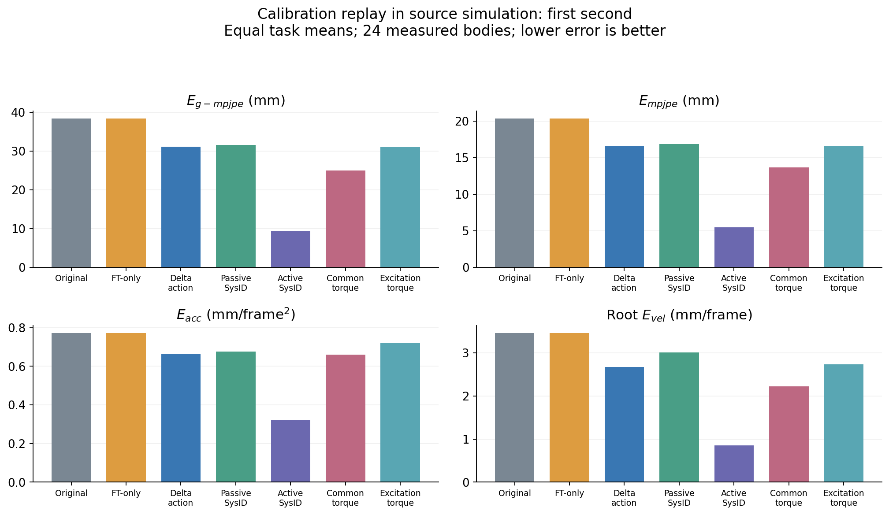
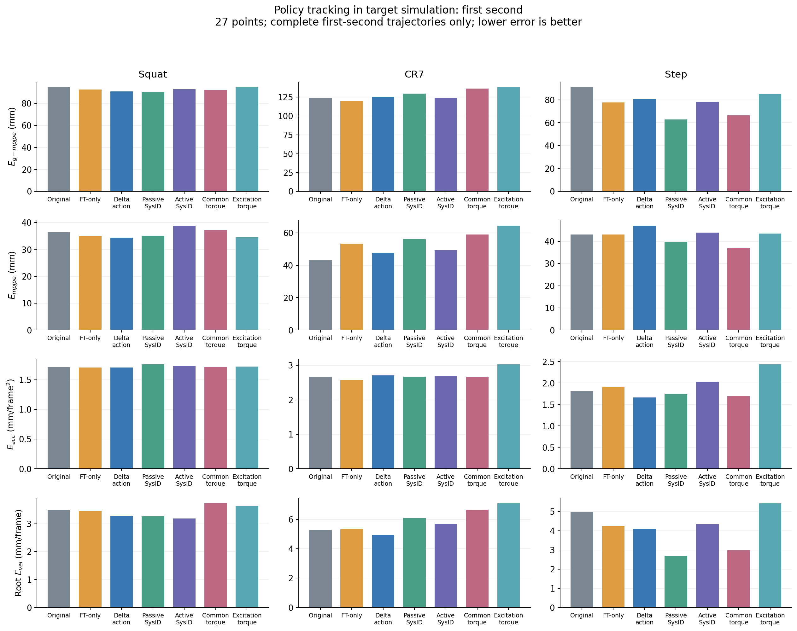
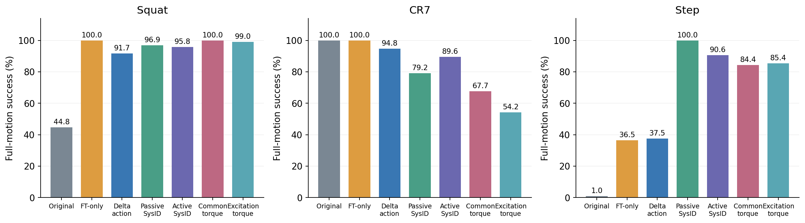
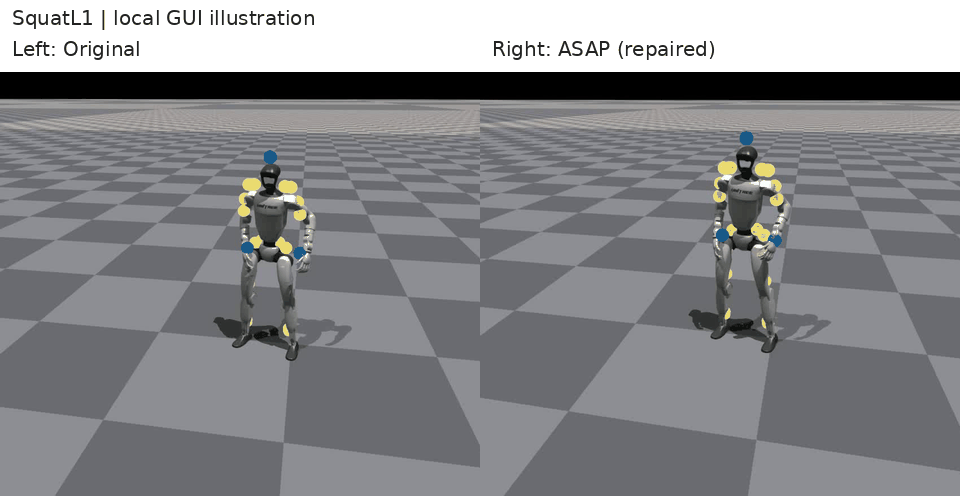
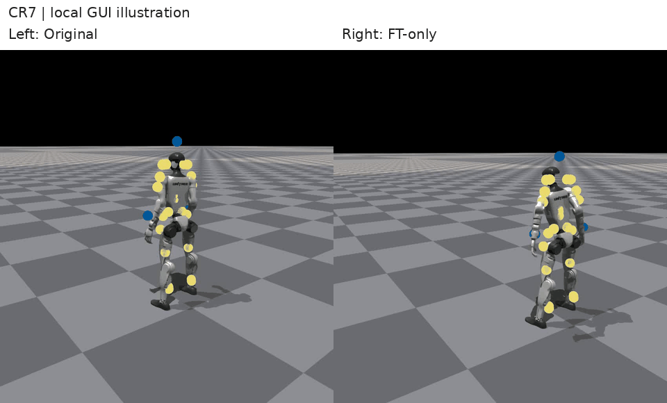
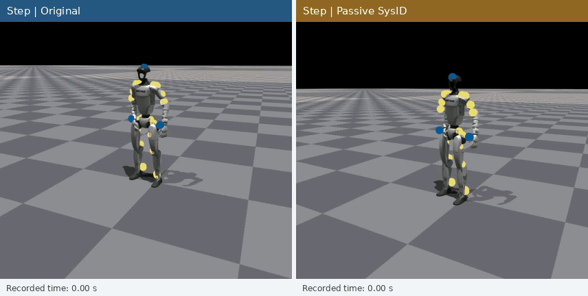
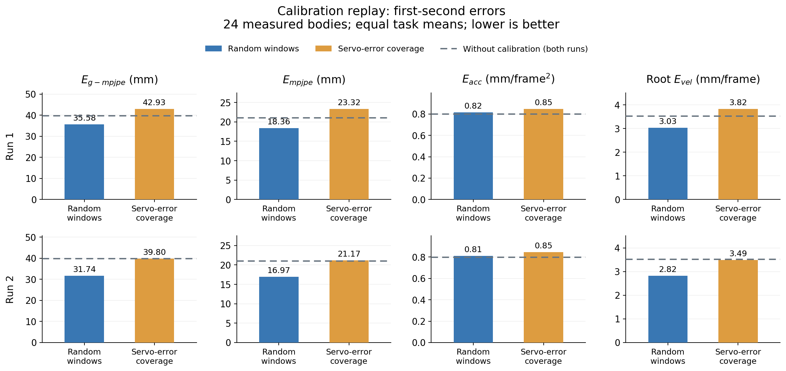
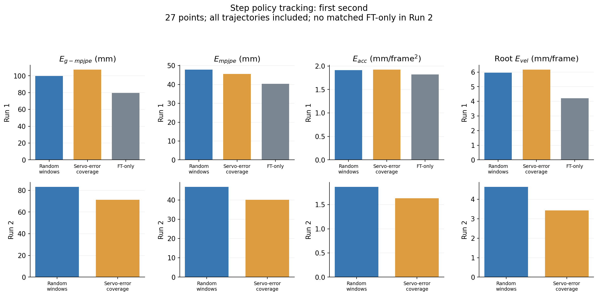

# Aligning Physics

## 1. Open research question

**For humanoid motion tracking with a learned residual alignment model, which calibration trajectory features improve open-loop replay when the amount of target data is fixed? Do these gains also improve closed-loop policy control?**

## 2. Background

Motion tracking asks a humanoid to follow a sequence of reference poses while maintaining balance. Reinforcement learning can train a control policy for this task in simulation. However, the pre-trained policy may behave differently on real world deployment, or other simulator, which is boardly called sim-to-real gap. Actuator response and contact dynamics can differ from the training environment.

One approach to handle this problem is to adjust simulation using data from the target domain. The adjusted environment is called **calibrated simulation** throughout this report. The picture from ASAP paper below shows the **delta action model** approach. 

Three works motivate the experiments:

| Work | What it adjusts | What data it uses |
|---|---|---|
| [ASAP](https://agile.human2humanoid.com/) | Position-target actions through a learned delta action model | Target motion-tracking policy rollouts |
| [SPI-Active](https://lecar-lab.github.io/spi-active_/) | Physical parameters through identification and active exploration | Responses to commands chosen for identification |
| [Unsupervised Actuator Net (UAN)](https://uan.csail.mit.edu/) | Actuator torque through a learned correction | Responses to wave and noise inputs |

These methods use different data to model different parts of the dynamics. They do not give a single data-selection rule for learned correction. Real world rollout trajectories was used to train delta action model by ASAP, and SPI-Active actively explore the informative command to excite the parameters to be identified. UAN tried to find data that provides broad coverage of actuator behavior.

We verified these ideas in [humanoidverse](https://github.com/LeCAR-Lab/HumanoidVerse) framework under a known ankle-stiffness change. Replay improved to different degrees, while control results were less consistent. This motivates the research question.

## 3. Experiments

Both domains use Unitree-G1 humanoid in IsaacGym. Four ankle stiffness values change from $K_p=20$ in source A to $K_p=16$ in target B. Other dynamics stay fixed. This known change helps interpret the results, and we consider the change as simulation of environment transfer.

| Method | Principle |
|---|---|
| Original | Deploy the source policy directly in B. |
| FT-only | Further train the policy in uncalibrated A. |
| Delta action | Learn an action correction from B recordings, then train the policy in calibrated simulation. Without any correction method. |
| Passive SysID | Fit ankle pitch and roll gains to recorded joint trajectories. To identify these parameters. |
| Active SysID | Design informative command offsets, collect new trajectories, and fit the gains. |
| Common torque | Learn a torque correction from the original motion-tracking recordings. |
| Excitation torque | Learn a torque correction from new wave/noise excitation recordings. |

Each task uses its source policy after **6k** PPO step updates. Then run these policies in B to collect commands and states. Calibration then makes replay in A approach those recorded B trajectories. Each adapted policy receives **1,000** further PPO updates in calibrated simulation. The final policy runs alone in B. FT-only receives the same number of policy updates. Calibration procedures differ between methods.

The SysID and torque methods adapt SPI-Active and UAN ideas to robot. This is not a full reproduction of either paper. Formulas and implementation differences are in [Methods](docs/methods.md). Settings, data collection and implementation fixes are in [Training details](docs/training_details.md).

### Open-loop replay

The chart compares replay in A with recorded trajectories in B over one second. It averages equally across tasks and original recordings. FT-only shares the Original replay value because this test uses fixed recorded commands.

All calibrated methods reduce the four mean errors. Active SysID gives the smallest errors. Its fitted pitch/roll gains, **15.80/15.59**, are also close to the target **16/16**. This is consistent with effective identification in this simple mismatch. It does not show that parameter fitting can capture every environment discrepancy, especially complex dynamics in real world. Passive SysID fits **13.01/10.42**, showing that a useful trajectory fit need not recover the physical parameters.

### Closed-loop motion tracking

Errors below cover the first second in B. Squat and Step include all trials. CR7 inclusion is 100% for Original, FT-only and Delta action; 95.8% for both SysID methods; 89.6% for Common torque; and 85.4% for Excitation torque. Full-motion success is shown separately.

Both tests report $E_{g-mpjpe}$, $E_{mpjpe}$, $E_{acc}$ and root $E_{vel}$. Units are mm, mm/frame² and mm/frame at 50 Hz. Replay uses 24 measured bodies; tracking uses 27 points. Success requires completing the motion while mean body distance stays within 0.5 m. Full-motion errors for successful trials are also retained in `results/metrics.csv`.

The original Step policy reaches 90.6% success in A but only 1.0% in B, confirming a transfer challenge under this protocol. Every adapted method improves success over Original on Squat and Step. CR7 already reaches 100% with Original and FT-only; calibration methods reduce its success. Better replay therefore does not guarantee better tracking or higher success. The experiments do not isolate the cause of this difference.

### Recorded examples

We choose serveral examples that show policy behavior in B. They are partial recordings with different start phases. When one recording ends first, its final frame remains visible with a still-frame label. Quantitative conclusions use the evaluations above.

**Squat — Left: Original. Right: Fine-tuned by Delta action model (ASAP).**
We observe that the policy without fine-tuning achieves better intermediate action completion but ultimately causes the robot to fall. After fine-tuning the policy using the delta action model, the robot no longer falls, yet tracking errors increase throughout the process, making the movements appear "conservative".\
Success rate: 44.8% to 91.7%\
Root-relative error: 50.62 to 55.78 mm

**CR7 — Left: Original. Right: FT-only.** Both policies jump and return to standing. Further training lowers global error but raises root-relative error. Both have 100% aggregate success.

**Step — Left: Original. Right: Passive SysID.** The original policy failed to keep the leg or heel aligned with the center of mass due to reduced ankle joint gain, resulting in a fall. Passive sysID method adapted more effectively, successfully executing the Step motion.

## 4. Suggestion from experiment results

The calibrated methods improve replay, but their policies do not consistently perform better in B. Replay evaluates the simulator using recorded commands. After fine-tuning, the policy can choose different commands and visit states that were rarely covered by the recordings. This could limit the usefulness of the learned correction, although the current experiments do not establish why control performance differs.

This leads to a more specific question: what should the calibration recordings contain? For the ankle-gain change used here, one candidate is the difference between the commanded and actual joint position, $e=q_{cmd}-q$. With equal damping and no torque saturation, the same state and command produce a torque difference of

$$
\tau_B-\tau_A=(16-20)e=-4e.
$$

The direction and magnitude of this position error therefore determine the immediate effect of the gain change. Joint range alone does not provide this information. A joint can move through a large angle while closely following its command, or move only slightly while remaining far from its commanded position.

This provides a reason to select recordings that cover different signs and magnitudes of ankle position error. However, larger errors are not automatically more useful: if both actuators reach the same torque limit, saturation can hide the gain difference. The action correction is also updated less frequently than the PD controller, so matching torque at one instant does not ensure that the whole trajectory will match.

These considerations motivate the data-selection hypothesis below. 

## 5. Hypothesis

**For the ankle stiffness change used here, expecting that recordings cover different signs and magnitudes of ankle servo error to help the delta action model learn the response difference. With the same amount of data and the same training budget, this model could reproduce unseen target trajectories more accurately than a model trained on randomly selected recordings.**

## 6. Minimum hypothesis test

To test this hypothesis, I keep the delta action method fixed and change how its training windows are selected. **Random windows** provide a baseline. **Servo-error coverage** selects windows that cover different signs and magnitudes of position error at each ankle.

Both groups use the same 18 target recordings, six from each motion. Each group selects one continuous window per recording, giving **954 transitions**. Task, phase, speed and contact-proxy quotas stay the same. Each dataset trains a new delta action model for 1,000 updates. Its frozen correction is then used to fine-tune the same Step source policy for 1,000 updates.

I repeat this process with a second pair of training seeds. The selected data, validation and test recordings stay unchanged, as do the evaluation seeds. In each chart, the top row is Run 1 and the bottom row is Run 2. Lower bars mean lower error.

### Does servo-error coverage improve replay?

The grey dashed lines show replay without calibration. The bars show the two learned corrections. These errors average equally across the three motions.

Random windows give lower error on all four measures in both runs. They also improve position and root velocity over uncalibrated replay, although acceleration error increases slightly. **Servo-error coverage does not improve on random selection in this test.** The proposed calibration benefit is therefore not supported by these results.

### Do the replay results carry over to control?

These bars show the resulting Step policies in B. Errors cover the first second, which every trial reaches. The grey dashed lines in Run 1 show a newly trained FT-only policy with the same training seed. There is no matched FT-only policy for Run 2.

In Run 1, neither residual policy completes Step, and both have higher errors than FT-only. FT-only itself has only **5.2%** success, so control remains difficult under this training setup.

Run 2 gives a different picture. Servo-error coverage has lower tracking error on all four measures and **33.3%** success, compared with **20.8%** for Random. Its replay is worse, yet its policy tracks better. **The replay ranking therefore does not predict the control ranking in this run.**

This small test shows calibration and fine-tuning control policy may need separated evaluation. It does not establish a reliable advantage for servo-error coverage. The actual coverage difference is small, speed and contact distributions still differ, and changing training seeds affects the outcome. A stronger data contrast and more training runs are needed to test the hypothesis further.

# Statement by author

The question I raise here is: with limited target-domain data, which information from actual robot motion helps a residual model learn dynamics differences and support the transfer of a control policy? The experiments above are an initial exploration of this question. Their conclusions are limited by the experimental setup and the scale of validation.

The current experiments only change the fixed gains of four ankle joints. Under ideal conditions with equal damping and no torque clipping, the action correction needed to match instantaneous torque is simply proportional to the difference between the commanded and actual joint angle. This setup is useful for checking the implementation and establishing interpretable comparisons, but it does not fully represent the complex differences involved in real transfer. Actuator response, friction and contact behavior can jointly affect robot motion. These responses may also vary between individual robots, loads and operating conditions. The current results need further validation under a wider range of controlled dynamics changes, cross-simulator transfer and hardware experiments.

I am more interested in the relationship between open-loop replay and closed-loop control. In ASAP, calibration data comes from real-world rollouts of the original policy, while the fine-tuned policy can behave differently in the real world. Even if the residual model enables accurate replay of existing recordings and generalizes to unseen trajectories collected in the same way, this does not automatically establish that it can support new control behavior. Moreover, average replay error does not distinguish which errors matter most for balance and motion completion. Changes in state and action distributions, the effect of errors on the task, and the ability of feedback control to compensate for them can all influence the final outcome. I consider this relationship a particularly worthwhile research question.

I also want to distinguish three limitations: whether the correction model can represent the target-domain differences, whether its training data contains the information needed to predict the response, and whether the recordings clearly reveal these differences or mix them with noise. If the correction structure or input information is insufficient, adding more similar recordings may still fail to solve the problem. Conversely, rollouts with poor motion completion can still provide useful state-action information, because calibration learns the robot’s actual response to commands, rather than using successful motions as demonstrations.

The servo-error selection did not show a consistent advantage, which led me to reconsider the reasoning from the physical equations to data selection. A direct relationship between servo error and gain mismatch does not imply that broader coverage will necessarily improve learning efficiency. For the simple gain change used here, random data may already provide sufficient excitation. I therefore consider it meaningful to investigate how data value depends on the type of mismatch, the correction model’s structure and the response conditions required by the subsequent task. I also believe that further research requires better simulation and real-world experimental infrastructure.

Finally, I had not previously studied humanoid RL planning and control in depth. This report grew out of my efforts to learn and explore the field, so it may contain misunderstandings or misleading interpretations.
