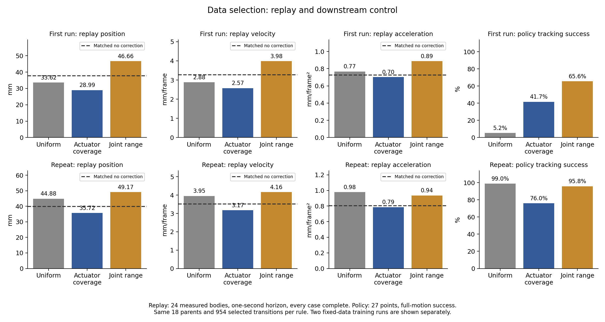

# Aligning Physics

## 1. Open research question

**For humanoid motion tracking with learned simulator correction, which calibration trajectory features improve replay at a fixed data budget? Do these improvements lead to better control after policy fine-tuning?**

## 2. How I arrived at this question

A humanoid policy can track a motion in simulation but fail on hardware. Differences in actuators and contacts contribute to this gap.

Different methods collect different data. [ASAP](https://arxiv.org/html/2502.01143v3) uses motion-tracking policy rollouts to learn an action correction. [SPI-Active](https://github.com/LeCAR-Lab/SPI-Active) designs commands for parameter identification. [UAN](https://arxiv.org/abs/2502.10894v1) uses wave and noise inputs to learn actuator torque corrections.

These works already study informative data. I want to understand its value for learned correction and subsequent control. Joint range is one candidate, but does not describe the response to commands. ASAP's different replay and control trends motivate the question without identifying a cause.

## 3. Hypothesis

**At the same data budget, data that covers relevant actuator conditions will improve calibration more than data chosen only for large joint range. The benefit should reach control when those conditions also occur during policy training.**

I test replay and control separately. Better replay alone does not confirm better control.

## 4. Why this seems plausible

For a PD actuator,

$$
\tau=K_p(q_{cmd}-q)-K_d\dot q.
$$

A stiffness error changes torque through $q_{cmd}-q$. Joint range does not measure this command error. Velocity, command changes and torque limits may also matter. Useful features depend on the mismatch.

A fine-tuned policy visits new states and chooses new actions. A correction that fits recordings may be inaccurate there. I therefore evaluate both replay and policy control. [Reasoning](docs/research_argument.md).

## 5. Method comparisons

I test G1 in IsaacGym: ankle stiffness is 20 in source A and 16 in target B. Other dynamics stay fixed. Original policies are tested in B. Calibration starts with ten B rollouts each from CR7, SquatL1 and StepFBL1.

I compare FT-only, ASAP delta action, two SysID variants and two torque corrections. Each policy gets 1,000 further updates in A and runs alone in B. SPI-Active and UAN ideas are adapted to G1. No state-transition residual is implemented. [Methods](docs/methods.md).

**Delta uses the completed input-noise repair on all three tasks.** Data, calibrator, source checkpoint, seed and update budget stay fixed. Other methods are unchanged. Both delta versions remain in the [before/after report](results/noise_repair/metrics.md). [Setting audit](docs/settings_audit.md).

Open-loop evaluation replays fixed B commands in calibrated A. The original and FT-only share the uncalibrated replay baseline, since policy weights do not enter this test.

Closed-loop errors compare policies with the reference in B over the first second. Early CR7 failures are excluded; [tables](results/method_comparison/metrics.md) give inclusion percentages and full-motion errors.

Both tests report $E_{g-mpjpe}$, $E_{mpjpe}$, $E_{acc}$ and root $E_{vel}$. Units are mm, mm/frame² and mm/frame at 50 Hz. Replay uses 24 measured bodies; control uses 27 points. Closed-loop success requires full completion and mean body distance within 0.5 m throughout. [Definitions](docs/evaluation.md).

**Reserved extension:** IsaacGym → IsaacLab/Genesis, using the same method comparison. No cross-engine results are available yet.

## 6. Observations that motivate the question

Delta action reduces replay position error from 38.42 to 31.12 mm. After noise repair, its success is 70.8% for Squat, 99.0% for CR7 and 25.0% for Step. None exceeds FT-only. Other calibration methods help Step; passive SysID reaches 100%, compared with FT-only's 36.5%.

Noise repair improves CR7 success but reduces Squat and Step success. This finding does not establish the cause of the remaining failures. Each main method has one training seed. The two torque datasets also differ, so their contrast does not isolate excitation.

A further [reset check](results/delta_reset_probe/metrics.md) found that delta training retains the previous episode's correction. Clearing it raises Step success from 25.0% to 37.5% and lowers all four first-second errors. Full-motion velocity and acceleration errors rise in the successful cohort, whose trials also change. Squat and CR7 are pending. The charts above still use noise-only repair. [Reset comparison](results/reset_repair/metrics.md).

The original Step policy succeeds at 90.6% in A and 1.0% in B. It learned the motion, but transfers poorly. CR7 already has 100% B success. [Source check](results/source_quality/metrics.md).

Equal-size trajectory subsets also produce different replay and control results. This motivates the question: **which trajectory properties make learned correction useful, and when do replay gains transfer to humanoid control?** These experiments do not identify one causal feature.

## 7. Minimum hypothesis test

I select equal-size subsets from the same 18 training rollouts. Each contains 954 transitions. The rules are uniform selection, actuator-feature coverage and large ankle range. Models and training budgets stay the same.

| Selection rule | First-run replay error (mm) | Repeat replay error (mm) | First-run completion (%) | Repeat completion (%) |
|---|---:|---:|---:|---:|
| Uniform | 33.62 | 44.88 | 8.3 | 99.0 |
| Actuator coverage | 28.99 | 35.72 | 41.7 | 77.1 |
| Large joint range | 46.66 | 49.17 | 77.1 | 95.8 |

Coverage improves replay in both runs, but not consistently control. **These results do not confirm the hypothesis.** The policies retain the noise and reset issues. Selection also changes phase and contact. The budget counts selected training data, rather than the cost of acquiring the larger pool. [Data-content experiment](results/content_selection/README.md).

[Experiment details](docs/experimental_protocol.md) · [Reproduction](docs/reproduction.md) · [Reading guide](docs/reading_guide.md)
