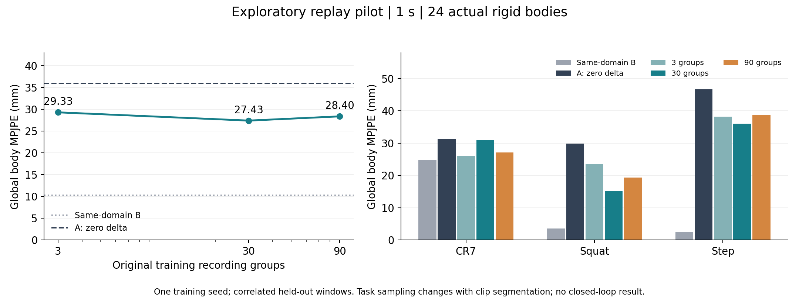
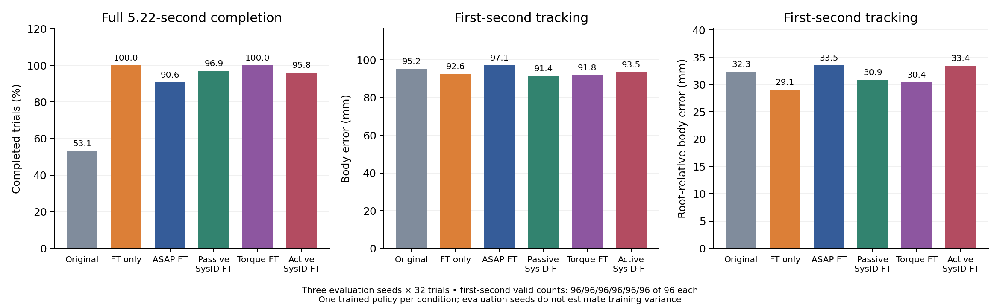
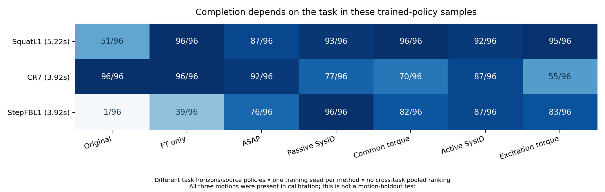

> **Open research question:** For humanoid motion-tracking policies adapted through a learned simulator correction, which measurable properties of a fixed-budget target-domain dataset make calibration improve both trajectory replay and downstream closed-loop control?

# Aligning Physics: What Makes Calibration Data Useful?

An experimental research proposal on calibration data for humanoid control, built on [ASAP / Humanoidverse](https://github.com/LeCAR-Lab/ASAP). The current experiments use a Unitree G1 model in **controlled sim-to-sim transfer**. They do not constitute hardware validation.

**Current evidence:** task/group-weighted mixed30 calibration reduces held-out body replay error by 19.0%, while velocity error slightly worsens. In the first completed Squat comparison, the resulting ASAP policy completes 87/96 target trials versus 96/96 for equal-budget fine-tuning without calibration. Replay benefit has therefore not produced an additional control benefit in this run. A matched high-rate acquisition intervention changes Squat completion from 34/96 to 95/96, with mixed tracking metrics and no additional completion benefit over FT-only. StepFBL1 supplies a positive task-dependent contrast: ASAP/passive SysID complete76/96 and96/96 versus FT-only39/96, with lower passive first-second global/root-relative errors. The direct coverage-versus-range subset test is now running; its learning outcomes remain pending. Measured results and proposed experiments are labelled separately.

## How I arrived at the question

A humanoid tracking a reference motion must coordinate actuator response, balance, and contact. A policy that tracks well in its training simulator can respond differently after deployment. More policy training is not necessarily enough when the simulator describes the wrong transition dynamics.

There are several ways to address this mismatch. Structured system identification estimates physical parameters; domain randomization trains across parameter variation; learned corrections adjust the simulator from target-domain observations. These approaches depend on both the model class and the information in the calibration data.

The data-collection choices in related work motivated this project:

| Work | Correction and data collection | What it suggests about data |
|---|---|---|
| [ASAP](https://arxiv.org/html/2502.01143v3) | Learns action corrections from pretrained motion-policy rollouts, then freezes the correction during policy fine-tuning. | Task rollouts can provide useful calibration data. |
| [SPI-Active](https://arxiv.org/html/2505.14266v1) | Uses sampling-based parameter estimation and optimizes exploration commands using Fisher information. | Excitation should depend on the parameters being identified. |
| [UAN](https://arxiv.org/html/2502.10894v1) | Learns actuator torque corrections from history; collects square-wave, sine-wave, and noise inputs. | Coverage can come from structured excitation rather than task-policy rollouts. |

[Contact-UAN's author project page](https://contact-uan.csail.mit.edu/) further reports cross-behavior reuse of walking calibration and highlights contact-consistent initialization. This strengthens the case for studying reusable dynamics regimes, and also warns that an apparent calibration benefit can partly correct replay artifacts.

These papers already study data informativeness or explicitly motivate excitation. **I am not claiming that informative data collection is an unstudied problem.** The narrower question is how to diagnose useful data for an ASAP-style learned correction, and whether its usefulness for replay predicts its usefulness for subsequent control.

ASAP's Fig. 10(a) is a particular motivation: replay generalization continues to improve with dataset size, while the reported closed-loop benefit changes little at the largest scales. This observation does not establish a causal explanation. It motivates separating three possibilities: additional data may repeat already-covered dynamics, improve errors that matter little to control, or fail to cover states visited by the fine-tuned policy. Model capacity, optimization, and initialization artifacts are alternative explanations that must be controlled.

## Hypothesis

**At equal calibration-data and optimization budgets, covering mismatch-sensitive actuator regimes that overlap downstream policy behavior will support learned calibration better than selecting data solely for large joint range or large uncorrected trajectory error.**

Here, useful regimes may include the direction and magnitude of commanded position error, torque headroom, joint velocity, and command change. Motion names and clip count are indirect proxies. Contact phase and history may matter for some mismatches, but are not assumed to be sufficient or necessary in advance.

There are two separately falsifiable parts:

1. Coverage-based selection improves replay on held-out target trajectories relative to uniform selection.
2. With the correction frozen during equal-budget policy fine-tuning, that improvement transfers to control in the target domain **without the correction at deployment**.

An improvement in replay alone supports only the first part. Equal or worse performance under coverage selection is an informative negative result.

## Why this hypothesis is plausible

Calibration aims to align transition models, rather than reproduce an action's name or its reference pose. For a PD actuator,

$$
\tau = K_p e-K_d\dot q,\qquad e=q_{\mathrm{cmd}}-q.
$$

A stiffness mismatch directly couples to the servo error $e$. A large joint excursion does not imply a large servo error, and two motions can excite similar actuator regimes despite having different names. This provides a concrete reason to measure command-state relationships rather than joint range alone.

The same reasoning is conditional on the mismatch: velocity-dependent friction, torque saturation, and delay need different excitation. It is not a theorem that one coverage measure is optimal for every residual model. For the present Kp test, velocity is a conditioning feature, not automatically an independent source of stiffness information. The post-step record also requires computing the next-transition servo error from state[i] and action[i+1].

Torque clipping further complicates “more excitation”: when both systems saturate in the same direction, increasing servo error can leave their instantaneous applied torques identical. A descriptive audit of the existing training pool finds substantially different command-state distributions and source-model saturation fractions across tasks. This motivates measuring torque headroom as well as range; it does not establish which subset trains a better model. [Feature analysis and figure](results/calibration_features/README.md).

Closed-loop adaptation adds another condition. The fine-tuned policy generates its own actions and visits its own states. A correction accurate on recorded inputs may be inaccurate on this changed distribution, or a policy may exploit its errors. Therefore, low average replay error need not be a sufficient proxy for downstream control quality. [The full research argument](docs/research_argument.md) derives these distinctions and lists competing explanations; [the experimental protocol](docs/experimental_protocol.md) makes them testable.

A [post-hoc deployment-feature audit](results/policy_regimes/README.md) now makes one part measurable: ASAP's first-second actuator states are farther from mixed30 calibration support than FT-only's. Passive SysID is farther still but has higher completion than ASAP. Thus distribution change is observable, while nearest-feature distance alone does not explain the control ranking. This descriptive audit does not replace the queued data intervention or measure calibrated-A training occupancy.

## What has actually been run

The completed pilot uses the same IsaacGym implementation in both domains:

- **Source A:** default ankle stiffness, $K_p=20$.
- **Target B:** ankle pitch and roll stiffness reduced to $K_p=16$; other modeled dynamics held fixed for the calibration comparison.
- **Data:** pretrained CR7, SquatL1, and StepFBL1 policies rolled out in B, recording actual states and executed nominal actions.
- **Calibration:** PPO delta-action learning in A, with physical corrections restricted to the four ankle joints. The existing network retains a 23-dimensional output interface and masks other corrections; this is not a literal four-output-network reproduction.
- **Evaluation:** held-out B recordings replayed in A, using fixed recorded nominal actions and state-conditioned learned corrections. The correction itself is a feedback model; “open-loop replay” refers to the recorded nominal action sequence.

The pilot required correcting action/frame alignment, restoring recorded initialization velocities, and correcting the frozen delta's action scaling and current-action conditioning. These are prerequisites for interpreting physical calibration, not evidence for the research hypothesis. [Implementation notes and patches](docs/reproduction.md) document the changes.

### Measured pilot results

Training subsets contain 3, 30, or 90 original environment-recording groups, equally divided across the three motions before segmentation. Automatic resets create multiple continuous clips per group. Splits are made by original recording group before creating evaluation windows.

| Setting | Training groups | Continuous training clips | Ankle RMSE (rad) ↓ | Joint-velocity RMSE (rad/s) ↓ | Global body MPJPE (mm) ↓ |
|---|---:|---:|---:|---:|---:|
| B replay, zero delta: same-domain check | — | — | 0.02041 | 0.56583 | 10.24 |
| A replay, zero delta: mismatch baseline | — | — | 0.07290 | 0.85052 | 35.99 |
| A replay, learned delta | 3 | 5 | 0.06682 | 0.93544 | 29.33 |
| A replay, learned delta | 30 | 41 | 0.05794 | 0.93312 | 27.43 |
| A replay, learned delta | 90 | 128 | 0.05654 | 0.87592 | 28.40 |

These are 1-second prefixes, using 24 actual simulated rigid-body positions. Means are averaged within original recording groups, then within tasks, then equally across tasks. The test partition contains 15 recording groups and 66 correlated windows. Checkpoints are selected using validation data, not test performance. This pilot has one training seed.

The learned corrections reduce global position error by approximately 18.5%, 23.8%, and 21.1% relative to zero correction. More data does not improve every metric: velocity error remains worse than the mismatch baseline for all three learned models.

**Two limitations prevent a clean data-scaling conclusion.** First, the original loader samples segmented clips uniformly. The CR7/Squat/Step sampling proportions change from 20/40/40% to approximately 24/27/49% and 23/30/47% across subsets. Data amount and task weighting are therefore confounded. Second, same-domain replay error is non-negligible, particularly for CR7; arbitrary-window initialization and configuration need further audit. The completed mixed30 run below explicitly controls task and recording-group weights. These results are an exploratory pilot, not confirmation of saturation or of the hypothesis.

Raw summary evidence and a detailed audit are in [results/pilot_multimotion](results/pilot_multimotion/README.md).

### New controlled run

The agreed mixed30 run has completed calibration and isolated validation/test replay with corrected task/group sampling. Validation selects the 500-update checkpoint. On the held-out test, global body MPJPE changes from **37.66 to 30.51 mm** and ankle RMSE from **0.07500 to 0.06131 rad**. Joint-velocity RMSE changes from **0.87892 to 0.89057 rad/s**, a regression. All 66 one-second test windows complete; same-domain body replay error is 7.40 mm. These outcomes support a partial replay benefit, not the downstream hypothesis. [Settings, raw evidence and an actual-motion baseline animation](results/controlled_squat/README.md).

### Matched closed-loop comparison

The task policies start from the same pretrained Squat checkpoint and receive 1000 additional PPO updates. Frozen corrections are used during training, then removed for standalone B deployment. Each method has one training seed and three evaluation seeds with 32 trials each; these 96 trials do not constitute 96 independent trained policies.

| Target policy | Completed trials / 96 ↑ | Mean survival (s) ↑ | First-second body MPJPE (mm) ↓ | First-second root-relative MPJPE (mm) ↓ |
|---|---:|---:|---:|---:|
| Original pretrained policy | 51 | 4.546 | 95.18 | 32.34 |
| Fine-tuning without calibration | 96 | 5.220 | 92.62 | 29.06 |
| ASAP fine-tuning with frozen delta | 87 | 4.984 | 97.14 | 33.52 |
| Fine-tuning with passive identified gains | 93 | 5.173 | 91.41 | 30.87 |
| Fine-tuning with shared torque model | 96 | 5.220 | 91.85 | 30.39 |
| Fine-tuning after active-acquisition SysID | 92 | 5.127 | 93.54 | 33.41 |

All 96 trials complete the first second, so its means include every trial. Full-horizon means over successful trials are reported separately. These conditions share zero task-observation noise, initialization noise and termination settings. The earlier original-policy evaluation inherited nonzero observation noise and is retained as a historical artifact; the table uses the completed common-noise reevaluation of all six checkpoints. [Raw trials, configuration/state audits, plots and actual-motion comparisons](results/matched_squat/README.md).

ASAP does not exceed the continued-training control on completion or first-second tracking. Passive SysID gives a slightly lower first-second global error but lower completion and higher root-relative error. Torque-model fine-tuning matches completion but has higher full-horizon body error: 105.12 versus 94.45 mm, both over 96 completed trials. There is no stable method ranking from one training seed, and no evidence here that a particular data feature caused these differences. [The passive estimator](results/passive_sysid/README.md) also fails to recover the configured gains exactly. A post-hoc replay test finds lower fitting loss at the estimated gains than at the known target gains, implicating the fitting objective or replay conditions as well as finite search; its exact cause remains unresolved.

### CR7 task-policy reuse

The [completed CR7 extension](results/task_extensions/CR7/README.md) reuses the frozen mixed-motion calibrators and trains each task policy for 1000 additional updates. Original/FT-only/ASAP/passive SysID/common torque/active SysID/excitation torque complete **96/96, 96/96, 92/96, 77/96, 70/96, 87/96 and 55/96**, respectively, over 3.92 seconds. FT-only lowers full-horizon global error (134.30→116.53 mm) but raises root-relative error (44.77→51.55 mm); both means cover all 96 trials. Calibrated conditions have no additional completion benefit in this seed. Some fail before one second, so their prefix errors must be read with valid-trial counts. CR7 was included in calibration; this is task-policy reuse, not a calibration-motion holdout.

### StepFBL1 task-policy reuse

The [completed StepFBL1 extension](results/task_extensions/StepFBL1/README.md) uses the same frozen calibrators and fresh equal-budget policies over3.92s. Original/FT-only/ASAP/passive/common torque/active/excitation complete **1/96,39/96,76/96,96/96,82/96,87/96 and83/96**. Passive SysID improves completion and first-second global/root-relative error versus FT-only (62.87/34.91 versus76.44/38.68mm, all96 valid). This is a positive closed-loop observation in one training seed, alongside the Squat/CR7 negative additional-benefit results. Later tracking means condition on different surviving subsets; no overall method ranking or causal data-feature explanation follows. All96 first stored states/actions per method and effective settings match; actual motion illustrations and raw audits accompany the results.

### Task dependence across completed comparisons

The same calibrators give different downstream outcomes across task policies. The columns retain each method; task horizons and pretrained policies differ, so tasks are not pooled into an overall score. [Counts, source hashes and limits](results/task_extensions/README.md). Every motion was present in calibration. Positive Step observations and negative additional-benefit observations on Squat/CR7 are both retained.

## Method comparisons and follow-up

The following status table refers to the original Squat comparison.

| Controller evaluated in B | Purpose | Status |
|---|---|---|
| Original pretrained policy | Direct-transfer baseline | Matched evaluation completed; 51/96 target trials |
| Policy fine-tuned in A without calibration | Equal-budget continued-training control | Completed; 96/96 target trials |
| Policy fine-tuned in A with frozen delta, deployed without delta | ASAP downstream benefit | Completed; 87/96 target trials |
| Policy fine-tuned with identified physical parameters | Structured SysID comparison | Completed; 93/96 target trials |
| Policy fine-tuned with a learned torque correction | UAN-method comparison | Replay and policy comparison complete; 96/96 target trials |
| Policy fine-tuned after active command acquisition and parameter refitting | G1 active-SysID adaptation | Completed; 92/96 target trials |

Each method must first pass replay and integration checks. Results will be recorded whether or not control improves. The goal is to compare correction mechanisms in a common G1 task, not assume the relative ranking reported on different robots and tasks transfers here.

The [method adaptation plan](docs/methods.md) distinguishes SPI parameter estimation from the additional active-exploration stage, and distinguishes an actuator torque model from an action residual. Adapted experiments will disclose differences in robot, data source, horizon, update rate, and model architecture. A parameter search alone will not be labelled a full SPI-Active reproduction.

The [completed torque-model replay](results/torque_adaptation/README.md) reduces body error from 36.69 to 24.48 mm, while velocity error increases from 0.862 to 0.951 rad/s. Its calibration architecture, rate and PPO transition count differ from the action model, so this is not a controlled representation ranking. A separate matched true-200Hz acquisition experiment has completed physical collection, same-domain replay checks and calibration: unchanged recorded inputs versus bounded wave/noise excitation, with identical torque models, unique-transition counts and optimization budgets. Its unchanged-input and excitation-trained policies complete 34/96 and 95/96, respectively, versus FT-only 96/96. Replay and tracking metrics show mixed tradeoffs. This is an observed acquisition-content effect in one training seed, without identifying which data feature caused it. [Measured high-rate comparison](results/wave_acquisition/README.md).

The minimal hypothesis experiment started after the completed task extensions with the required five-hour margin before GPU cutoff. Its first uniform-subset calibration is running; learning outcomes remain pending. It fixes the same 18 parent recordings and 954 unique transitions per uniform, actuator-coverage and joint-range arm. [The selector preview](results/content_selection/README.md) documents the training-only features and selection budget; it is not a learning result. A second paired training seed is conditionally queued after the primary comparison, reusing exact selected data. Inspecting a larger previously acquired pool controls the selected training budget, not acquisition cost. Complete-motion holdout remains a separate proposed experiment; the current pilot and queued test do not provide it.

## Reproducibility and interpretation

- [Experimental protocol](docs/experimental_protocol.md): data budget, splits, controls, metrics, and falsification criteria.
- [Method formulations and adaptation boundaries](docs/methods.md).
- [Replay corrections and reproduction notes](docs/reproduction.md).
- [Experiment status](docs/STATUS.md): completed evidence versus planned work.

The matched Squat closed-loop measurements are available. Active acquisition succeeded after a disclosed uniform start-window revision; active-policy evaluation is complete (92/96); the genuine high-rate comparison is complete (unchanged/excitation 34/96 and 95/96). CR7 and StepFBL1 training/evaluation are complete; the minimal data-selection test is running. The controlled stiffness mismatch is a deliberately narrow mechanism test; it cannot establish full sim-to-real fidelity or hardware performance.

## References

1. [ASAP: Aligning Simulation and Real-World Physics for Learning Agile Humanoid Whole-Body Skills, v3](https://arxiv.org/html/2502.01143v3).
2. [Sampling-Based System Identification with Active Exploration for Legged Robot Sim2Real Learning, v1](https://arxiv.org/html/2505.14266v1); [official implementation](https://github.com/LeCAR-Lab/SPI-Active).
3. [Bridging the Sim-to-Real Gap for Athletic Loco-Manipulation, v1](https://arxiv.org/html/2502.10894v1).
