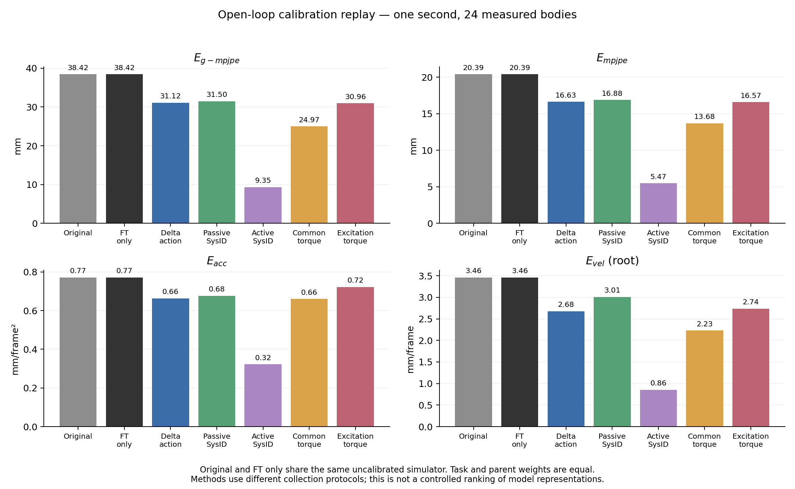
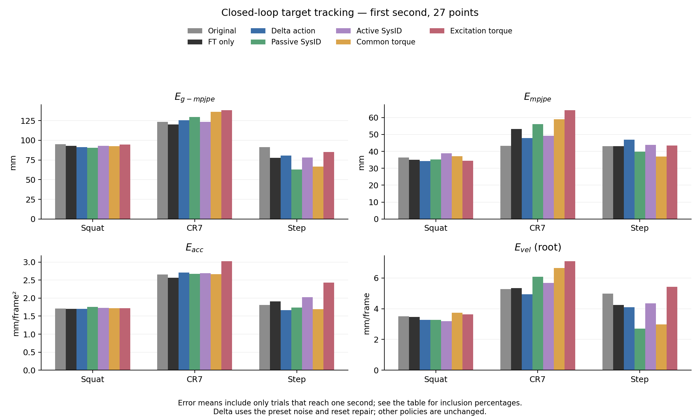
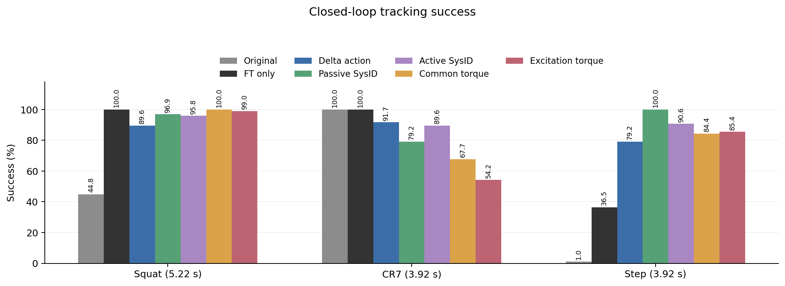

# Aligning Physics

## 1. Open research question

**For humanoid motion tracking with learned simulator correction, which calibration trajectory features improve replay at a fixed data budget? Do these improvements lead to better control after policy fine-tuning?**

## 2. How I arrived at this question

A humanoid policy can track a motion in simulation but fail on hardware. Differences in actuators and contacts contribute to this gap.

Different methods collect different data. [ASAP](https://arxiv.org/html/2502.01143v3) uses motion-tracking policy rollouts to learn an action correction. [SPI-Active](https://github.com/LeCAR-Lab/SPI-Active) designs commands for parameter identification. [UAN](https://arxiv.org/abs/2502.10894v1) uses wave and noise inputs to learn actuator torque corrections.

These works already study informative data. I want to understand its value for learned correction and subsequent control. Joint range is one candidate, but does not describe the response to commands. ASAP's different replay and control trends motivate the question without identifying a cause.

## 3. Hypothesis

**For the ankle-stiffness mismatch, windows covering different signs and magnitudes of unsaturated ankle servo error will reduce held-out replay error more than random windows at the same data and optimization budgets. Whether this gain improves control is tested separately.**

I test replay and control separately. Better replay alone does not confirm better control.

## 4. Why this seems plausible

For a PD actuator,

$$
\tau=K_p(q_{cmd}-q)-K_d\dot q.
$$

A stiffness error changes torque through $q_{cmd}-q$. Joint range does not measure this command error. Velocity, command changes and torque limits may also matter. Useful features depend on the mismatch.

A fine-tuned policy visits new states and chooses new actions. A correction that fits recordings may be inaccurate there. I therefore evaluate both replay and policy control. [Reasoning](docs/research_argument.md).

## 5. Method comparisons

I test G1 in IsaacGym: ankle stiffness is 20 in source A and 16 in target B. Other dynamics stay fixed. Original policies are tested in B. Calibration starts with ten B rollouts each from CR7, SquatL1 and StepFBL1.

I compare FT-only, ASAP delta action, two SysID variants and two torque corrections. Each policy gets 1,000 further updates in A and runs alone in B. SPI-Active and UAN ideas are adapted to G1. No state-transition residual is implemented. [Methods](docs/methods.md).

**Delta uses the completed noise and reset repairs on all three tasks.** Data, calibrator, source checkpoint, seed and update budget stay fixed. Other methods are unchanged. The [noise comparison](results/noise_repair/metrics.md) and [reset comparison](results/reset_repair/metrics.md) retain all versions. [Setting audit](docs/settings_audit.md).

Open-loop evaluation replays fixed B commands in calibrated A. The original and FT-only share the uncalibrated replay baseline, since policy weights do not enter this test.

Closed-loop errors compare policies with the reference in B over the first second. Early CR7 failures are excluded; [tables](results/method_comparison/metrics.md) give inclusion percentages and full-motion errors.

Both tests report $E_{g-mpjpe}$, $E_{mpjpe}$, $E_{acc}$ and root $E_{vel}$. Units are mm, mm/frame² and mm/frame at 50 Hz. Replay uses 24 measured bodies; control uses 27 points. Closed-loop success requires full completion and mean body distance within 0.5 m throughout. [Definitions](docs/evaluation.md).

**Reserved extension:** IsaacGym → IsaacLab/Genesis, using the same method comparison. No cross-engine results are available yet.

## 6. Observations that motivate the question

Delta action reduces replay position error from 38.42 to 31.12 mm. After noise and reset repairs, its success is 91.7% for Squat, 94.8% for CR7 and 37.5% for Step. FT-only reaches 100%, 100% and 36.5%. The small Step difference does not establish superiority. Passive SysID reaches 100% on Step.

The repairs do not uniformly improve control. Each main method has one training seed. The two torque datasets also differ, so their contrast does not isolate excitation.

A [reset check](results/delta_reset_probe/metrics.md) found that delta training retains the previous episode's correction. Clearing it raises Squat and Step success and lowers all four first-second errors in both tasks. CR7 success falls from 99.0% to 94.8%, with mixed error changes. Full-motion errors do not uniformly improve, and successful cohorts change.

The original Step policy succeeds at 90.6% in A and 1.0% in B. It learned the motion, but transfers poorly. CR7 already has 100% B success. [Source check](results/source_quality/metrics.md).

Equal-size trajectory subsets also produce different replay and control results. This motivates the question: **which trajectory properties make learned correction useful, and when do replay gains transfer to humanoid control?** These experiments do not identify one causal feature.

## 7. Minimum hypothesis test

The new test compares Random-N with Servo-coverage-N. Both use the same 18 training parents and 954 transitions. Each trains its own delta action model. Both then fine-tune Step with the repaired inputs and reset. A fresh FT-only policy shares the first training seed. Low-error-N is a supplemental calibration control if time remains. The selection rules are frozen before learning. [Design and limits](docs/servo_error_experiment.md). Random calibration is complete: test global error falls from 39.77 to 35.58 mm, while acceleration worsens slightly. Servo-coverage and Step control remain pending. [Partial results](results/servo_error_selection/primary/random/replay_metrics.md).

Earlier subset experiments improved replay with actuator coverage, but control varied greatly across training seeds. Those policies retain the old noise and reset issues. Their [results](results/content_selection/README.md) remain exploratory.

[Experiment details](docs/experimental_protocol.md) · [Reproduction](docs/reproduction.md) · [Reading guide](docs/reading_guide.md)
