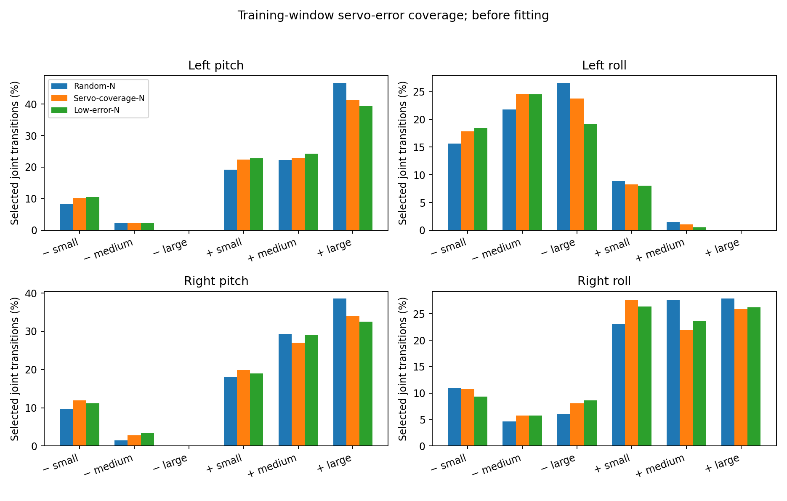

# Servo-error experiment

## Question and hypothesis

Which calibration windows help a delta action model correct an ankle-stiffness mismatch? Do replay gains improve Step tracking after policy fine-tuning?

The source and target use the same IsaacGym environment. Four ankle gains change from 20 to 16. Other dynamics stay fixed.

At a shared state and command, with equal damping and no clipping, the torque difference is $-4e$, where $e=q_{cmd}-q$. The instantaneous source-command correction is $-0.2e$. This motivates studying the signs and magnitudes of servo error. It does not prove that larger errors are better. A 50 Hz correction also does not guarantee alignment at every 200 Hz physics step.

The hypothesis is that unsaturated servo-error coverage improves held-out replay over random selection at equal budgets. Transfer to control is a separate question.

## Data groups

| Group | Rule | Evaluation |
|---|---|---|
| Random-N | Random eligible window within each fixed quota | Replay and Step control |
| Servo-coverage-N | Add windows that fill per-ankle sign and magnitude bins | Replay and Step control |
| Low-error-N | Choose the lowest mean unsaturated error within each quota | Supplemental replay only |

Each group uses the same 18 training parents: six each from CR7, Squat and Step. One continuous 54-state window per parent gives 954 unique transitions. Task, available-phase, coarse speed and contact-proxy quotas match. Sampling weights are equal by task and parent. This selected budget does not include the cost of collecting or inspecting the larger pool.

Magnitude edges come from training data. Positive and negative errors are counted separately for each ankle. Servo-coverage maximizes a diminishing-return score over the 24 bins. It does not simply choose the largest errors. Missing bins stay missing.

Nominal source PD torque estimates identify clipping. Eligible windows have at most 25% clipped joint samples. This is a nominal source estimate, rather than a measurement that both domains stay unsaturated. Actual contact forces were not recorded. Foot height and vertical speed provide a contact proxy, rather than measured contact mode.

## Preflight limits

The first CPU preflight could not fill late Step reference-phase quotas. It is preserved as a failed preflight. Before learning, all groups were changed to the same training-candidate phase tertiles. These describe the available pool, not full-motion phase coverage.

Random and Servo-coverage both have 7.4% estimated clipping. Their average ankle RMS speeds are 2.07 and 2.27 rad/s. Contact-proxy fractions also differ. The total coverage score rises from 26.72 to 27.25. The servo coverage contrast is modest. Matching coarse bins does not match continuous distributions. Selection can still change contact and initialization conditions.

The actual selection manifest, bin edges and sampler files are frozen. No window will be replaced after inspecting physical replay or learning results.

## Training and evaluation

Each main arm trains a fresh delta action model for 1,000 updates. Architecture, rewards and sampling remain fixed. Validation chooses between updates 500 and 1,000 using global body MPJPE. All arms share isolated validation and test recordings. Test results never select the group used for control.

Both main arms fine-tune the same Step model_6000 for 1,000 updates. Height and foot-force input noise are zero. Reset clears the previous episode's correction. All other settings use the completed reset-repair recipe. The final policy is fixed at update 1,000. A fresh primary-seed FT-only policy uses the same recipe without correction.

Replay reports four ASAP errors, ankle position and velocity errors, and per-ankle small/medium/large error strata. The strata use the fixed training edges. Their inclusion differs, so they are reported with sample coverage. Same-domain zero-correction checks remain diagnostics; their errors are not subtracted.

Step runs alone in target B. We report the four tracking errors and full-motion success. Runtime termination rules stay fixed. Recorded terminations are preserved and are not automatically called falls. Replay uses 24 measured bodies; Step evaluation uses 27 points. The two point sets are reported separately.

The first run uses calibration seed 20309009 and policy seed 20310009. A second paired run uses 20309010 and 20310010 if at least 2.2 hours remain before the GPU cutoff. Replay seed 20309109 and deployment seeds 8101–8103 stay fixed across runs. The repeat compares the two selectors; it has no new matched FT-only policy. Low-error calibration follows only if at least 50 minutes remain. Skipped stages are recorded explicitly.

## Logging limit

The replay helper reuses the root same16 log and command names. The test check replaces these names after the selected-training check. Split-specific recordings, reports and configs remain separate. No physical check is repeated to hide this limit.

## Interpretation

Better replay with better Step tracking supports both stages in this setting. Better replay without better tracking supports calibration alone. Similar replay means this selector and budget did not show an advantage. A weaker Low-error result may suggest that response information matters, without proving that Servo-coverage improves on random selection.

Two training seeds are a small sensitivity check. They cannot establish a population ranking. All three motions appear in calibration. This experiment does not test unseen motions, hardware or another mismatch.
