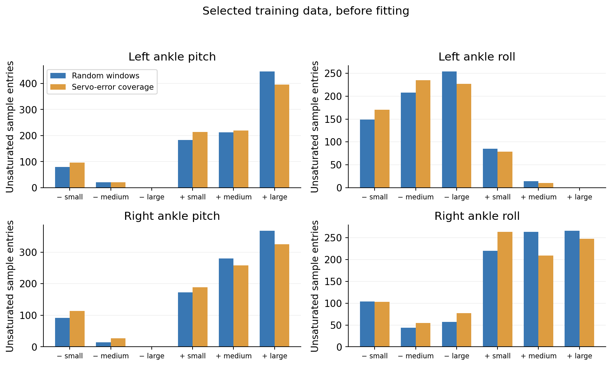

# Training, data and evaluation

This document gives the settings behind the main comparison and the servo-error experiment. Saved configuration examples are in `ASAP/experiment_configs/`. They retain the actual values and original file paths. Replace asset, checkpoint, dataset and output paths before running them on another machine.

## Environment

| Item | Setting |
|---|---|
| Simulator | IsaacGym Preview 4, Python package 1.0rc4 |
| Robot | G1, 23 controlled joints; four ankle joints differ between domains |
| Source A / target B | Ankle pitch and roll stiffness 20 / 16 |
| Ankle damping | Pitch 0.2; roll 0.1, unchanged |
| Physics / policy rate | 200 Hz / 50 Hz |
| Position-target action scale | 0.25 rad per action unit |
| Ankle torque limit | 50 Nm, summed nominal and corrective torque |
| Domain randomization | Disabled in source training and controlled experiments |
| GPU | One NVIDIA RTX 4090, 24 GB |
| Python / PyTorch | 3.8.20 / 2.4.1 |
| NumPy / SciPy | 1.23.5 / 1.10.1 |
| Hydra / OmegaConf | 1.3.7 / 2.3.1 |
| CMA-ES / Joblib / Ninja | 4.4.0 / 1.4.2 / 1.13.2 |

The source snapshot is based on ASAP commit `df5320cc47dd8cad97961bdfabfe402dd62ad999`. `ASAP/source_manifest.yaml` gives hashes of the installed core files and runtime extensions. The five core files were copied from the completed experiment environment without changes. Queue and reporting scripts are not part of the public source snapshot.

## Source policy and calibration data

Each motion uses its own recorded `model_6000.pt`, after 6,000 PPO updates. This checkpoint is used throughout all adaptations. The saved CR7 config permits a much longer run, but the experiment uses update 6,000 rather than its configured maximum. Source training uses 4,096 parallel environments. The source policy is not assumed to be equally strong on all tasks. Under the matched evaluation settings, Original success in A/B is 88.5%/44.8% for Squat, 100%/100% for CR7 and 90.6%/1.0% for Step. Source-domain summaries are retained in the final metrics CSV.

Running each source policy in B records actual joint/body states, velocities, commands and reset flags. Human reference motions define the tracking task; these robot recordings define calibration targets. Commands and state transitions are not correction labels.

The full training pool has 90 original rollouts and 18,775 transitions at 50 Hz. Main calibration uses ten rollouts per task, thirty in total. Reset flags split these into 41 continuous segments with 6,198 transitions, about 124 seconds. Task, recording and segment receive equal hierarchical sampling weights. PPO repeatedly uses these same target recordings; parallel source rollouts do not increase the amount of target data.

Validation and test each use fifteen separate original rollouts. Continuous windows give sixty validation cases and sixty-six test cases. Splitting precedes window extraction. No window crosses a reset, and no original rollout appears in both training and held-out groups. All three motion types occur in calibration; this is not an unseen-motion test.

| Calibration method | Data and fitting procedure |
|---|---|
| Delta action | Main 6,198-transition dataset; one-second source replay episodes |
| Passive SysID | One central one-second window per segment; first 0.25 seconds enter the fitting loss |
| Active SysID | Thirty new records per unchanged/random/optimized input arm; 1,530 transitions per arm at 50 Hz |
| Common torque | Main measured 50 Hz records; actual 200 Hz source histories |
| Excitation torque | Thirty new records per arm; 208 genuine 5 ms states each, 6,210 transitions per arm |

The native-rate acquisition also has an unchanged-command arm. It is the matched control for the excitation acquisition. The older Common torque model differs in collection phase and duration, so the two main torque bars do not isolate excitation alone.

## Learning settings

| Parameter | Delta calibration | Policy fine-tuning |
|---|---:|---:|
| Parallel environments | 2,048 | 2,048 |
| PPO updates | 1,000 | 1,000 |
| Steps per environment/update | 24 at 50 Hz | 24 at 50 Hz |
| PPO epochs / mini-batches | 5 / 4 | 5 / 4 |
| Discount / GAE | 0.99 / 0.95 | 0.99 / 0.95 |
| PPO clip / desired KL | 0.2 / 0.01 | 0.2 / 0.01 |
| Initial actor learning rate | 0.001 | 0.0001 |
| Initial critic learning rate | 0.001 | 0.001 |
| Entropy coefficient | 0.01 | 0 |
| Selection | Validation at updates 500 and 1,000 | Fixed final update 1,000 |

Both delta calibration and the motion policy use ELU MLPs with hidden sizes 512→256→128. Delta actor inputs include height, foot force, base velocity, gravity, joint state, previous correction and incoming nominal action. Its critic also sees body-reference features. Policy actor inputs include proprioception, reference phase and history; the critic also sees reference tracking features. Complete observation lists and reward scales are in the saved YAML configs. The delta action-norm penalty is −0.1.

The adaptive-KL learning-rate schedule remains enabled. Policy weights and action standard deviations are loaded from source, while optimizers and the update counter are reset. Torque calibration uses 96 PPO steps at 200 Hz, rather than 24 at 50 Hz. Its different architecture and transition count prevent a controlled representation comparison.

Main delta calibration selects update 500. The final comparison uses policy fine-tuning after both noise and reset fixes on every task. The calibrator and source checkpoints stay fixed across those repairs. Other methods retain their completed policies. Earlier versions remain in Git history and the experiment archive; the public figures use one final version.

Fine-tuning is not an exact continuation of pretraining or an exact reproduction of the paper recipe:

| Setting | Source training | Shared fine-tuning recipe |
|---|---|---|
| Action-rate penalty | −0.5 | −0.2 |
| Penalty curriculum | Enabled, initial scale 0.1 | Disabled, scale 1 |
| Motion-distance termination | Enabled with tightening curriculum | Disabled during training |
| Initial-state noise level | 0 | 0.2 |
| Sensor noise | Nonzero on several channels | Zero on used channels |

These differences remain fixed in the repair and selection experiments. Their effects have not been isolated. The paper discusses action-correction regularization 0.1 in its horizon analysis and lists 0.2 in a separate table; this difference was not treated as a proven implementation bug.

## Implementation fixes

The replay code uses post-step recordings. State at row $i$ precedes the incoming command at row $i+1$. Reference clocks, commands and scored states must follow this convention.

| Issue | Implemented change |
|---|---|
| Replay time and command alignment | Select incoming recorded actions on the correct frame and align the reference with the post-step clock. |
| Initial velocities | Restore recorded joint, root linear and root angular velocities instead of substituting motion-library estimates. |
| Delta units and conditioning | Use the current nominal action and apply the position-target correction consistently. Only ankle outputs affect physics. |
| Frozen-model input noise | Set base-height and foot-force noise to zero in policy fine-tuning, matching delta calibration. The former height input received uniform noise of ±1 m. |
| Reset memory | `ResetSafeDeltaClosedLoop` clears `actions_closed_loop` only for environments that reset. |
| Evaluation records | Record actual body tensors and hand/head extensions at the current clock. Keep reset flags and exclude reset transitions from derivatives. |

The installed core changes are in `train_delta_a.py`, both delta environment files, `motion_tracking.py` and `motion_lib_base.py`. Opt-in classes add sampling, recorder and reset behavior. The original five installed files remain byte-identical to the archived experiment versions.

A physical no-update probe confirmed that stale correction input changes inference at reset. Noise-only and reset repairs produced mixed control changes across tasks. Fixing an input issue does not establish that it caused every performance loss. These issues concern delta training, not the SysID or torque methods.

The upstream optional keyboard listener raises a NameError in completed evaluation logs. Main evaluation processes finish and recorded trials pass independent metric audits. This listener was not patched during the experiments. One replay helper also overwrites its root train/test diagnostic log label; the split-specific recordings, configurations and reports remain in the archive.

## Minimal experiment: making different datasets

The code is `ASAP/research/asap_diagnostics/select_servo.py`. It operates only on the training pool and produces continuous windows, not a sequence of selected high-score frames.

1. Compute servo error separately for the four ankles using state row $i$ and action row $i+1$.
2. Estimate source PD torque as $20e-K_d\dot q$. Samples below 50 Nm are treated as nominally unsaturated. A candidate window may have at most 25% clipped joint samples.
3. Define small/medium/large magnitude bins using each ankle's training-only one-third and two-thirds quantiles. Count positive and negative errors separately, giving 24 bins.
4. Assign quotas for task, available motion phase, coarse speed and a contact proxy. Random selection fills the quotas randomly. Servo-error coverage greedily fills underrepresented servo bins.
5. Use the same eighteen original training rollouts, six per task. Each supplies one continuous 54-state window, giving 954 transitions for each rule. Sampling weights remain equal.

The diminishing-return score is

$$
C(H)=\sum_{j=1}^{24}\log(1+H_j/53),
$$

where $H_j$ is the total number of selected unsaturated entries in bin $j$. Coverage selection maximizes the incremental score. It is not selection by largest error. Unavailable bins remain empty.

Phase quotas use training-candidate phase tertiles. The initial full-reference phase design could not supply late Step windows and was revised before learning. Speed bins use task/phase median ankle RMS velocity. Contact is estimated from ankle height and vertical velocity, not measured force. Coarse matching does not equalize all continuous distributions.



Both groups have estimated clipping 7.4%. Random/coverage ankle speed is 2.07/2.27 rad/s; coverage scores are 26.72/27.25. Contact fractions differ. This is a modest feature contrast. It also excludes collection and inspection of the larger pool from the selected-data amount.

Same-domain zero-correction training-window errors are 21.52/19.61 mm. These reconstruction diagnostics remain nonzero. They are neither subtracted from learned errors nor used to replace windows. They leave initialization and contact phase as possible contributors to the comparison.

`results/selected_windows.csv` preserves selected source rows, phases and measured features. `results/selection_parameters.yaml` preserves bin edges and quotas. Low-error windows were also prepared, but no corresponding model was trained.

The selection API returns datasets and a manifest:

```python
from research.asap_diagnostics.select_servo import select

# training_segments: reset-free training records with task/recording metadata.
# raw_training_rollouts: original task-indexed recordings.
# motion_durations: durations of the three reference tasks.
datasets, manifest = select(
    training_segments, raw_training_rollouts, motion_durations, seed=7709)
```

Run 1 uses calibration/policy seeds 20309009/20310009. Run 2 uses 20309010/20310010 with byte-identical selected data. Replay seed 20309109 and deployment seeds 8101–8103 remain fixed. Both calibration and policy seeds change together, so this is whole-pipeline sensitivity. There is no new matched FT-only in Run 2. Both data rules receive control evaluation regardless of replay ranking.

## Evaluation definitions

Let $p_{tj}$ and $r_{tj}$ be robot and reference body positions, with root index 0. Every error is a mean Euclidean distance:

$$
E_{g-mpjpe}=1000\,\mathrm{mean}_{t,j}\|p_{tj}-r_{tj}\|,
$$

$$
E_{mpjpe}=1000\,\mathrm{mean}_{t,j}\|(p_{tj}-p_{t0})-(r_{tj}-r_{t0})\|.
$$

Root velocity uses the first root-position difference. Body acceleration uses the second body-position difference:

$$
E_{vel}=1000\,\mathrm{mean}_{t}\|\Delta p_{t0}-\Delta r_{t0}\|,\qquad
E_{acc}=1000\,\mathrm{mean}_{t,j}\|\Delta^2p_{tj}-\Delta^2r_{tj}\|.
$$

Differences are per frame at 50 Hz: mm/frame and mm/frame². They are not mm/s and mm/s². The paper calls velocity a root metric, while its official SMPLSim helper averages velocity over bodies. We report root velocity in figures and retain body velocity separately in CSV.

Open-loop replay compares 24 measured body positions in A against recorded B positions. The main chart presents completed implementations, not a pure model-family ablation. Torque replay uses its own uncalibrated control (global error 37.43 mm), while the Original replay bar is 38.42 mm. These controls are retained in the CSV; replay seeds and setup states differ between procedures. Closed-loop tracking compares 24 rigid bodies plus three extended hand/head points against the reference. The point sets are not pooled. Torque correction already acts during the setup step, so learned/zero replay warm states may differ. They are retained rather than forced to match. The setup warm frame is excluded from error means. Derivatives never cross a reset. Tracking success requires full completion and mean distance across all 27 points at most 0.5 m at every stored pre-reset frame, including the warm state.

| Evaluation setting | Value |
|---|---|
| Deployment | Ordinary B environment, no correction hooks |
| Observation noise / initial-state noise | 0 / 0.2 |
| Enabled termination | Gravity X/Y threshold 0.8, motion-distance threshold 1.5 m, motion end |
| Disabled termination | Contact, low height, joint/velocity/torque limits |
| Termination curriculum | Disabled |
| Squat reference | 261 frames, 5.22 s |
| CR7 and Step references | 196 frames, 3.92 s |
| Evaluation seeds | 8101, 8102, 8103; thirty-two trials per seed |

First-second error means include only complete first-second prefixes. Figures disclose inclusion. Successful full-motion error means condition on success and therefore compare different cohorts. Empty cohorts have no mean. A termination is not automatically classified as a fall.

Before publication, audits checked actual checkpoints, training settings, first stored states/actions/clocks and effective B configurations. Metrics were recomputed from physical records. Three deployment seeds do not constitute three independent training runs. Main methods have one training seed; the minimum test has two fixed-data runs.

## Using the source snapshot

Install IsaacGym Preview 4 separately, then install the vendored Python packages in a compatible environment:

```bash
cd ASAP
python -m pip install -e .
python -m pip install -e isaac_utils
export PYTHONPATH="$PWD:$PWD/humanoidverse:$PYTHONPATH"
```

SMPLSim and the SMPL model files required by the motion library are external dependencies. The G1 URDF, meshes and three reference motions are included. Policy weights and target recordings are not public downloads in this repository; they are in the separately downloaded experiment archive. The local visualization bundle contains the six selected policies and their saved configs.

The experiment uses `seeded_entry.py` because upstream entrypoints do not seed before constructing the environment. This entrypoint imports IsaacGym before PyTorch, sets thread counts, seeds RNGs and calls the upstream train/eval entrypoint. It is retained as a training initialization fix; remote launchers and queue managers are removed.

For example, after rebasing input and output paths, train with a saved complete config:

```bash
python research/asap_diagnostics/seeded_entry.py train --rng-seed 20310009 \
  --config-path "$PWD/experiment_configs" --config-name selection_step_policy \
  checkpoint=/absolute/path/to/source/model_6000.pt \
  algo.config.policy_checkpoint=/absolute/path/to/random_delta/model_1000.pt \
  robot.motion.motion_file="$PWD/humanoidverse/data/motions/g1_29dof_anneal_23dof/TairanTestbed/singles/0-motions_raw_tairantestbed_smpl_video_step_forward_back_level1_filter_amass.pkl" \
  experiment_dir=/absolute/path/to/new_run save_dir=/absolute/path/to/new_run/.hydra \
  output_dir=/absolute/path/to/new_run/output
```

The analogous calibration config needs the selected record file and a sampling manifest. `hierarchical_weights` in `controlled_sampling.py` produces weights from the dataset metadata. `WeightedGridDeltaReplay` requires identical motion keys and records each task's sample allocation. Do not remove failing windows to make the manifest fit.

For a graphical evaluation, use the saved policy's neighboring config and the ordinary target environment:

```bash
python research/asap_diagnostics/seeded_entry.py eval --rng-seed 8101 \
  +checkpoint=/absolute/path/to/policy/model_1000.pt +headless=False +num_envs=1 \
  ++env._target_=humanoidverse.envs.motion_tracking.motion_tracking.LeggedRobotMotionTracking \
  ++algo._target_=humanoidverse.agents.ppo.ppo.PPO \
  ++env.config.add_extra_action=False \
  ++robot.control.stiffness.ankle_pitch=16 ++robot.control.stiffness.ankle_roll=16 \
  ++robot.motion.motion_file=/absolute/path/to/reference.pkl
```

This is a viewer command, not the quantitative evaluation recipe. For quantitative evaluation, use `step_evaluation.yaml`, its PaperTrackingRecorderPPO settings, the fixed trial count and seeds, and new output paths. Rebase the `eval_overrides` paths as well. Never select a policy checkpoint based on those test results.

Final figures can be read directly. `results/metrics.csv` contains pooled and per-task summaries with cohort labels. `control_trials.csv` retains individual final evaluations. `replay_cases.csv` retains the main and minimum-test replay evidence; `servo_strata.csv` retains per-ankle strata. Code for errors and strata is in `paper_metrics.py`, `replay_scoring.py` and `servo_replay_metrics.py`. The extracted fitting/scoring APIs were checked on CPU; extraction did not create new physical results.
