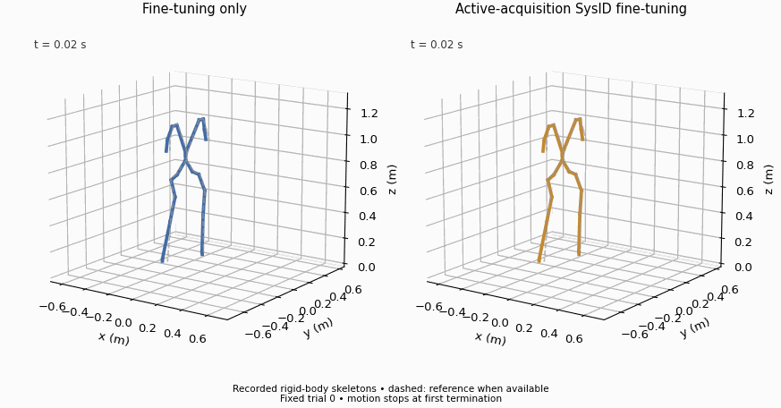

# Active command design and new target acquisition

**Status:** revised command design, physical target acquisition, parameter refitting and isolated replay completed. Optimized-arm Squat fine-tuning and deployment completed:92/96 trials, with no additional benefit over FT-only 96/96. This is a G1 adaptation of SPI-Active's information-based exploration principle, using prerecorded motion commands plus bounded ankle dither rather than the original Go2 command-conditioned interface.

## Failed first attempt and explicit revision

The first attempt used a central window in each parent's longest continuous segment. The unchanged control was infeasible under gain perturbations around the passive estimate in CR7 recordings 007 and 008; the random control additionally failed in recording 001. These exceeded the declared root-height or projected-gravity limits before command optimization. The pipeline stopped, preserving every input, candidate gain, replay and log. [Failed-control scores](initial_failed_controls.json) and [per-trajectory violations](initial_failure_details.json) expose the checks. All 13 invalid trajectories still had 50 frames and no reset: feasibility here is stricter than merely avoiding simulator termination.

The revised protocol uniformly uses the first 54 states of each parent's first eligible segment. All 30 parent groups remain, with the original height≥0.35 m and projected-gravity horizontal magnitudes≤0.8 limits. No individual failure group was dropped and no limit was loosened. This changes motion phase and the design population; it is not an independent replication of the initial protocol. [Revision and archive description](revision.json).

## Completed acquisition

Design uses paired ±0.5 gain perturbations around the passive estimate, a stated independent 5 mrad ankle-position noise model, a regularized information matrix, and six CMA-ES generations of eight candidates. Selected sinusoidal amplitudes are 0.02059/0.07999 rad for pitch/roll, at 2.008/2.059 Hz. These are position-target perturbations, divided by action scale 0.25 at the nominal action interface. The optimized inverse-information objective is 0.000944 versus 0.006573 for unchanged commands. This is a design-model score, not measured target identification accuracy. [Selected designs](selected_designs.json).

Each unchanged, random and optimized arm collects 30 target groups, ten per motion. Every group supplies 52 actual post-step frames at 50 Hz (51 within-record transitions), with identical parent identities, initial-window selection and duration across arms. All 90 acquired trajectories pass the declared one-second feasibility check and no-reset check. Maximum discrepancy between the executed nominal command and the stored command is exactly 0 for every group. [Acquisition audit](acquisition_audit.json). The first sample follows the warm step; it is not an extra unrecorded initial state counted as a transition.

## Parameter refitting and held-out replay

All arms use eight CMA-ES generations of twelve candidates from source 20/20 and the same first-0.25-second trajectory objective. Fitting sees only its newly acquired training data; known 16 is not an optimizer input. [Identified gains and training losses](identified_comparison.json). Each arm completes all 66 original held-out test windows; [raw validation/test metrics](replay_comparison.json) preserve per-task results.

| Acquisition arm | Pitch Kp estimate | Roll Kp estimate | Training objective | Test body error (mm) | Test joint-velocity error (rad/s) |
|---|---:|---:|---:|---:|---:|
| Unchanged | 15.7871 | 15.6620 | 0.05931 | 9.342 | 0.53568 |
| Random excitation | 16.0058 | 16.2712 | 0.01480 | 8.679 | 0.53887 |
| Optimized excitation | 15.8025 | 15.5854 | 0.03136 | 9.170 | 0.52827 |

The estimates are closer to configured 16/16 than the older passive fit. This also changes collection phase and the source recordings, so it cannot identify which single factor caused the difference. The information-optimized design does not uniformly beat random excitation: its design objective is better than unchanged, but random has lower training loss and held-out position error. Velocity gives a different comparison. Training losses across different command datasets are not a common held-out accuracy metric. One design/acquisition seed cannot establish an active-method ranking or robust parameter identifiability.

The optimized-arm policy comparison uses the fixed fitted model regardless of the other arms' test ranking. Better information scores, closer gains or lower replay errors did not establish additional control benefit in this run. After 1000 Squat updates, the policy completes 92/96 target trials, mean survival 5.127 s; first-second body/root-relative errors are 93.54/33.41 mm versus FT-only 92.62/29.06 mm. All 96 complete the first second. Full-horizon body error over 92 successful trials is 106.06 mm and must be read with failures. [Raw trials](tracking_comparison.json), [summary](tracking_summary.json), [all-method comparison](../matched_squat/README.md).

The [stored-state/configuration audit](matched_state_config_audit.json) verifies exactly matching first states/actions for all 32 seed8101 trials relative to FT-only, common noiseless task inputs and original termination settings. There is one training seed; these evaluation trials do not establish training variance. Unchanged/random arms have calibration replay comparisons, but only the predeclared optimized arm received a downstream policy run.

This animation uses fixed seed8101, trial0 for both policies, with actual recorded simulated body positions and dashed reference positions. It stops each panel at its first termination and does not replace aggregate outcomes. It is a derived skeleton view, not a Gym render. [Provenance](../../assets/animations/matched_squat_active.json).
