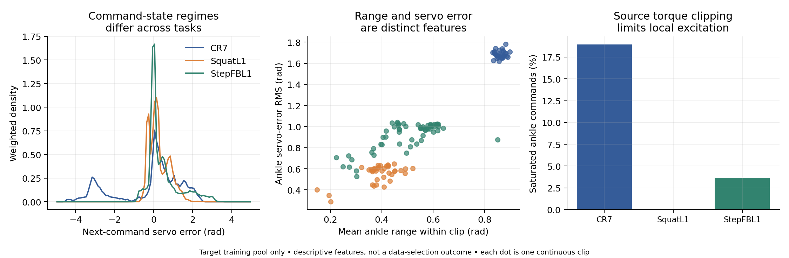

# Descriptive actuator-regime audit



This analysis uses the existing **training partition only**: 90 original recording groups, 128 continuous clips, and 18,775 transitions. It does not evaluate a trained model, rank data subsets by downstream utility, or establish a causal relationship.

For each next transition, the ankle servo error is `default + 0.25 * action[i+1] - dof[i]`. Saved post-step action[i] belongs to the preceding transition. The four ankle default positions are `[-0.2, 0, -0.2, 0]` radians. The source saturation diagnostic evaluates `abs(20*error - Kd*qdot) >= 50 Nm`, using pitch damping 0.2 and roll damping 0.1. It is a source-model calculation at target states, not measured target torque.

| Task | Recording groups | Continuous clips | Transitions | Source nominal saturation |
|---|---:|---:|---:|---:|
| CR7 | 30 | 30 | 5,730 | 18.94% |
| SquatL1 | 30 | 38 | 7,486 | 0.009% |
| StepFBL1 | 30 | 60 | 5,559 | 3.65% |

Density and saturation averages give each group equal weight inside its task, each continuous clip equal weight inside a group, and each transition equal weight inside a clip. Each scatter point is one continuous clip; points are correlated through their original recording groups. Descriptive clip-level correlations are retained in [summary.json](summary.json); they are not significance tests.

The observations support measuring command-state relationships and saturation regimes. They do not establish that range is useless, that large error is desirable, or that coverage selection improves calibration. The next controlled test must compare selected subsets at equal budgets.

Recreate from trusted target-training data:

```bash
python scripts/inspect_calibration_features.py --dataset /path/to/balanced_full.pkl
```

The underlying rollout files are excluded from this repository; the reproducibility overlay can recreate them from the source policies.
