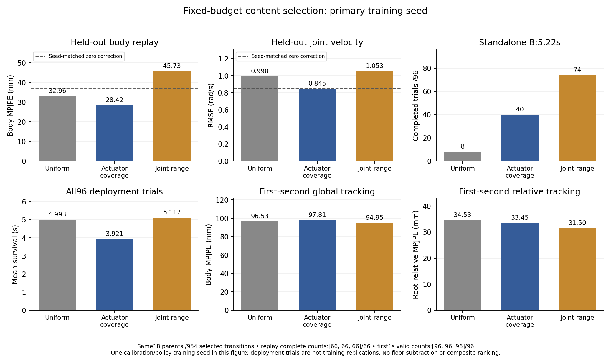
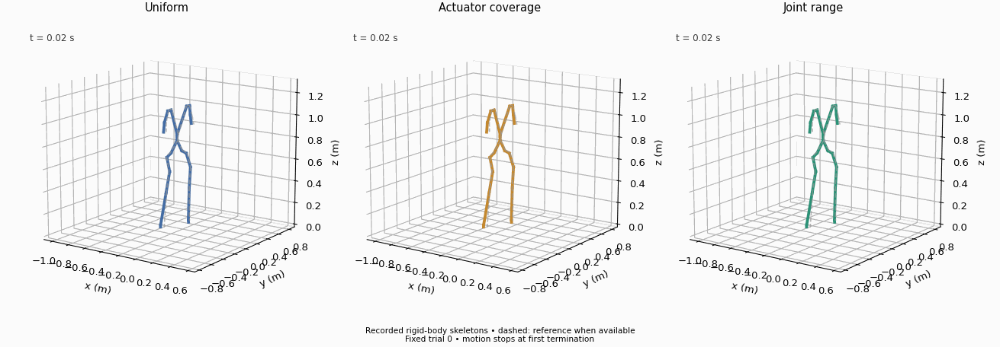

# Fixed-budget data-content study: first paired seed complete

All three primary conditions completed. The second paired seed started uniform calibration at16:49:51Z on2026-10-08 and is running serially; its results are not yet available. A post-repeat queue will measure fresh replay controls at that repeat's seed. The GPU cutoff remains2026-10-09T09:00Z.

## Fixed data and learning budgets

Every selector uses the **same18 original training recording groups**, six per motion, and one54-state window per group: **954 unique next-state transitions**. Parents are fixed with seed7701. The400 candidate windows come from an existing18775-transition training pool; validation/test groups are isolated. This controls selected training-data amount, not total acquisition or inspection cost.

| Selector | Choice within each fixed parent |
|---|---|
| Uniform | Seeded random eligible window. |
| Actuator coverage | Greedy max-min distance between robustly scaled28-dimensional actuator summaries; first window nearest the pool center. |
| Joint range | Maximum mean ankle joint excursion. |

The coverage summaries contain signed servo-error mean/std, velocity mean/RMS, command-change RMS, nominal-source unsaturated fraction and near-clipping fraction for each of four ankles. Servo error uses state[i] with action[i+1]. Scaling is fitted on training data only. These are diversity heuristics, not explicit controller-sensitivity optimization or enforced future policy occupancy.

[The public preview](selection_manifest_preview.json) and [actual selection](selection_manifest_actual.json) match exactly, including windows and scaler. No selector or window changed after observing physics or learning outcomes. Each condition has the same architecture, task/group sampling, calibration seed20305008, policy seed20306008,1000 calibration updates and1000 fresh Squat policy updates. Validation selects between calibration checkpoints500/1000; task policies use fixed-final1000. Standalone B deployment attaches no learned correction.

## Complete primary results

| Selector | Test body (mm) | Test velocity (rad/s) | Same-domain training-record floor (mm) | Squat completion /96 | Survival (s) | First1s body/root-relative (mm) |
|---|---:|---:|---:|---:|---:|---:|
| [Uniform](primary/uniform/README.md) |32.9622|0.989788|10.1366|8|4.9929|96.5322/34.5262|
| [Actuator coverage](primary/coverage/README.md) |28.4211|0.845004|17.1059|40|3.9206|97.8063/33.4469|
| [Joint range](primary/joint_range/README.md) |45.7327|1.052676|26.3861|74|5.1173|94.9529/31.4977|

All learned test replays complete66/66 one-second windows; all selected-record floor checks complete18/18; all policies have96 valid first-second prefixes. The shared primary Source20 zero control is36.9190mm body,0.074967rad ankle and0.853221rad/s velocity. [Full table including conditional full-reference means](primary/metrics.md), [machine-readable results and method-minus-uniform contrasts](primary/summary.json), [all288 raw policy trials plus replay summaries](primary/comparison.json), [actual primary plan](primary/plan.json).

Coverage has lower replay body, ankle and velocity errors than uniform/range in this primary seed. It completes more trials than uniform, but has shorter mean survival and mixed first-second tracking. Joint-range has worse replay than the zero control, yet higher completion, longer survival and lower first-second errors than coverage. Replay ordering therefore does not determine downstream ordering in this run. The combined replay-and-control hypothesis is not confirmed; no post-hoc scalar weighting declares a winner.

The differing same-domain floors10.14/17.11/26.39mm matter: changing windows also changes temporal/contact phase and replay initialization conditions. Floors are retained without subtraction or replacing windows. Equal parent identities and transition counts do not isolate one causal actuator feature. This experiment observes dataset-construction effects under fixed model/budgets; it does not identify why control changes or establish a population ranking.

First-three-second valid counts are95/61/95 for uniform/coverage/range. Full-reference means condition on8/40/74 successes. Completion and survival include all96 trials; prefix/full errors retain their valid counts. All recorded terminations remain visible and are not automatically classified as falls. Replay uses equal task/group weights; shortened-window metrics would require separate completion accounting, although all primary test windows finish.

## Actual-motion illustration and audits

This is an actual recorded-body skeleton animation with dashed reference, not a Gym camera render. It uses seed8101 trial0 for every selector, without choosing by outcome. Uniform terminates atrow251; the other two displayed trials complete. This index-fixed illustration does not represent the aggregate40/96 coverage or74/96 range completion rates. [Selection, recording hashes and animation metadata](../../assets/animations/content_selection_primary_trial0.json).

Each condition report links its audit of all96 first stored deployment states/actions, effective observation noise, original termination settings, initialization/physics,26150Hz frames and ordinary task-only deployment. All match the historical FT-only recordings. That old FT-only policy trained at another seed, so it remains contextual evidence, not a fresh same-seed training control. Audits do not establish hidden contact-solver-state equality.

Learned test replay starts for all three selectors match the shared primary Source20 zero first samples exactly, including nominal actions and motion times. The first stored clock is0.02s after `reset_all`'s warm physics step, not the assigned pre-step state. Historical mixed30 controls use another replay seed and must not replace the primary controls. The condition reports preserve the ancillary keyboard-listener errors and main-recorder completion markers; no record was discarded or core/listener patch applied.

The prepared [reporter](../../scripts/report_content_selection.py) was run on the complete primary root. It verifies all selectors, exact preview/scaler, planned seeds/budgets,96 unique trial identities per policy and expected replay counts. [Plotting code](../../scripts/plot_content_selection.py) reports separate metrics without pooling seeds or ranking by a composite score. Artifact checks are distinct from physics validation.

## Prespecified repeat and fresh controls

[The repeat queue plan](repeat_queue_plan.json) was recorded before primary learning outcomes. It reuses byte-identical selected train/validation/test files and sampler manifests with SHA-256 checks, changing calibration/policy seeds to20305009/20306009 for every selector. Its startup verifies inputs as each condition starts. It retains all three conditions,1000+1000 updates, validation500/1000 and fixed-final task policies. No favorable seed is selected. The required four-hour cutoff margin passed; uniform calibration is running, while coverage/range wait. Primary failure would have blocked the repeat rather than silently restarting it.

The replay launcher also advances validation/test seed20305108→20305109; policy deployment seeds remain8101–8103. Thus the repeat is not optimizer-only variance. Primary floors and replay baselines are copied with provenance as reused diagnostics, not fresh repeat measurements. Two fixed-data training seeds would provide a small pipeline-sensitivity check, not acquisition replication or reliable population uncertainty.

[The post-repeat control plan](repeat_controls_queue_plan.json) schedules fresh Source20 and Same16 zero-correction test replays at20305109 after all repeat learning/evaluation finishes, with a15-minute cutoff margin. It changes no training, selectors, validation choice or threshold. Copied artifacts remain separate; first stored learned/source20 states must match before attributing correction gains. These fresh controls are pending. The reporter accepts completed repeat/fresh controls through `--repeat` and `--repeat-controls`, reports each seed's contrasts separately, and never treats192 deployment trials as192 training replications.
