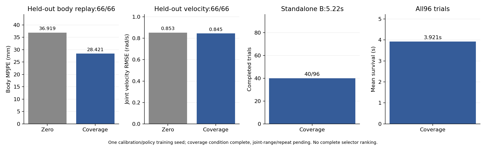

# Primary actuator-coverage subset: completed condition

This is the second completed condition of the prespecified18-parent/954-transition study. All three primary selectors are complete and the full reporter has run. The prespecified repeat is running. [Complete primary comparison](../../README.md). These one-seed observations do not establish a population ranking.

## Calibration and held-out replay

Both validation candidates complete60/60 windows. Body error is36.7967mm at500 updates and36.5218mm at1000; validation selects `model_1000.pt`. [500-update validation](validation_500.json), [1000-update validation](validation_1000.json), [selection](delta_selection.json). Every selector receives1000 calibration updates; selected checkpoints can differ.

| Test replay,1s | Body MPJPE (mm) | Ankle RMSE (rad) | Velocity RMSE (rad/s) | Complete windows |
|---|---:|---:|---:|---:|
| Shared primary Source20,zero correction |36.9190|0.074967|0.853221|66/66|
| Source20,coverage correction |28.4211|0.058051|0.845004|66/66|

Coverage lowers all three displayed errors against its shared primary zero control. The completed uniform condition has32.9622mm body error and0.989788rad/s velocity error; these are paired data-construction observations in one training seed, not an estimate of population performance. [Raw condition report](comparison.json), [summary](summary.json), [shared controls](../shared_test_baselines.json).

## Standalone Squat policy

The fixed final1000-update policy completes **40/96** trials, with mean survival3.9206s of5.22s. First-second body/root-relative errors are97.8063/33.4469mm over all96 prefixes. Three-second errors are168.3866/68.8078mm over61 valid prefixes. Full-reference errors are158.9858/58.0661mm over40 successful trials only. Keep these populations explicit.

Coverage completes more trials than uniform40/96 versus8/96, but has shorter mean survival3.9206 versus4.9929s. Uniform has many late terminations; coverage has56 terminations from2.16 to4.64s. [Every termination](termination_timing.json) is retained without automatic fall classification. Different survivor sets prevent treating the three-second/full-reference errors as failure-inclusive scores. No post-hoc metric weighting declares a winner.

## Integrity and interpretation

[The deployment audit](matched_state_config_audit.json) verifies all96 first stored joint/root states and actions against historical FT-only, effective noise/init/termination/physics,26150Hz frames and standalone task-only deployment. That FT-only policy has a different training seed and is contextual evidence, not a fresh same-seed training control.

[The replay audit](replay_initial_sample_audit.json) checks all66 first stored learned/source20 samples, including motion times, for exact equality, and verifies byte-identical uniform/coverage test files. The first stored time is0.02s after the reset warm step; this does not establish equality of hidden solver state. [Existing evaluation logs](runtime_log_audit.json) retain the ancillary keyboard-listener error and recorder completion markers; no physics rerun or listener patch was performed.

The coverage selected-training-window same-domain floor is17.1059mm, compared with uniform10.1366mm. [Measured floor](selected_subset_replay_floor.json). Neither floor is subtracted and no selected window is replaced. The intervention changes temporal/contact phase and initial replay conditions together with actuator features. Better held-out replay and different policy outcomes therefore do not identify a unique causal feature, establish the occupancy component of the hypothesis, or demonstrate robust training performance. The completed joint-range condition has worse replay but higher completion and longer survival; the prespecified second seed remains necessary evidence.
