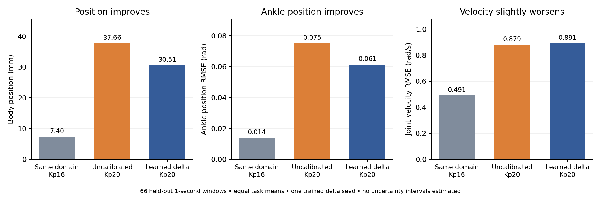
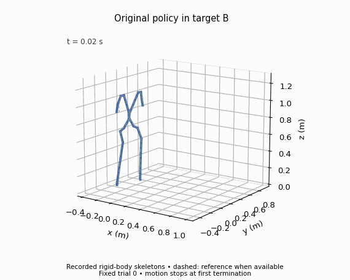
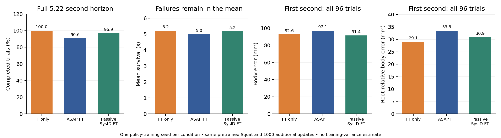
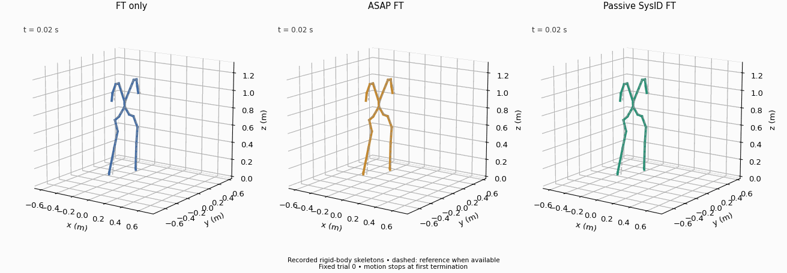

# Controlled mixed30 calibration and Squat adaptation

**Status:** calibration, both task-policy fine-tuning conditions and standalone deployment evaluation have completed. ASAP does not outperform equal-budget continued training in the first comparison. [The completed common-observation-noise reevaluation](../matched_squat/README.md) extends the core comparison to six checkpoints and supersedes the historical original-policy baseline. The separate excitation-trained torque policy appears in the [three-task overview](../task_extensions/README.md).

The calibration data contain 30 original target recording groups: ten CR7, ten SquatL1, and ten StepFBL1. The sampler gives equal probability to tasks, to groups within a task, and to continuous segments within a group. Its [sampling manifest](sampling_manifest.json) records these probabilities. The first draw into 2048 parallel environments was CR7 687, SquatL1 657, and StepFBL1 704; expected task weights are 1/3, while a finite draw is approximate.

Training uses the agreed Kp20→Kp16 mismatch, four ankle physical corrections, 200/50 Hz physics/correction, a nominal one-second episode budget, and 1000 PPO updates. [Validation selection](delta_selection.json) chose `model_500.pt` over `model_1000.pt`: validation global body MPJPE was 30.66 versus 35.03 mm. Both validation candidates completed all 60 evaluation windows. Test data were not used for this choice.

## Held-out replay

| Test condition | Ankle RMSE (rad) ↓ | All-joint RMSE (rad) ↓ | Joint-velocity RMSE (rad/s) ↓ | Root error (mm) ↓ | Global body MPJPE (mm) ↓ |
|---|---:|---:|---:|---:|---:|
| B Kp16, zero correction | 0.01398 | 0.00932 | 0.49133 | 7.03 | 7.40 |
| A Kp20, zero correction | 0.07500 | 0.03480 | 0.87892 | 39.32 | 37.66 |
| A Kp20, learned correction | 0.06131 | 0.03003 | 0.89057 | 31.37 | 30.51 |

All three conditions complete all 66 one-second windows from the isolated test partition. Results average windows within recording groups, groups within tasks, and tasks equally. They use 24 actual rigid bodies. [Raw replay summaries](replay_comparison.json) include shorter horizons and per-task metrics.

Relative to the mismatched zero-correction baseline, learned calibration reduces global position error by 19.0% and ankle error by 18.2%. Joint-velocity error rises by approximately 1.3%. This establishes useful changes in replay, not uniformly improved dynamics or a downstream-control benefit. Same-domain replay is still nonzero and sets a visible interpretation limit.

This run and the earlier clip-uniform pilot use different training/evaluation seeds and sampling. Their numerical difference is not a controlled sampler ablation.

## Initial target policy check

The original Squat policy in B terminated at approximately 3.9 seconds of the 5.22-second evaluation, in one clean-initialization trial. [Its report](vanilla_clean.json) includes errors on shorter completed prefixes. The full-horizon position mean is intentionally unavailable when no trial completes. This is an integration baseline, not an aggregate completion-rate estimate.

This animation is derived from actual recorded rigid-body positions, with dashed reference positions. It is a skeleton visualization, not an IsaacGym camera render. It shows fixed trial 0 and freezes at the first termination rather than playing the automatically reset episode as a continuation. It does not show a learned-policy result.

## Completed policy comparison

Both policies use the same pretrained Squat checkpoint and 1000 additional iterations: continued source training without correction versus source training with frozen selected delta. The passive SysID policy also uses that checkpoint and fine-tuning budget. All are evaluated in unchanged B without a correction, using the original Squat termination criteria, initialization-noise level 0.2, zero task-observation noise and three seeds of 32 environments.

| Policy | Complete / 96 | Mean survival (s) | First-second body error (mm) | First-second root-relative error (mm) | Complete-trial full body error (mm) |
|---|---:|---:|---:|---:|---:|
| FT only | 96 | 5.220 | 92.62 | 29.06 | 94.45 |
| ASAP FT | 87 | 4.984 | 97.14 | 33.52 | 96.91 |
| Passive SysID FT | 93 | 5.173 | 91.41 | 30.87 | 95.98 |

The first-second means include all 96 trials. The full-horizon means condition on completion, so their populations differ and failures must remain visible. [Aggregated measurements](tracking_summary.json) and [raw trial reports with the setting audit](tracking_comparison_initial.json) include additional horizons. Three deployment seeds do not estimate training variance: each condition trains one policy.

[Checkpoint provenance](checkpoint_provenance.json) records hashes computed directly from the completed server files. The [first-frame audit](initial_state_audit.json) verifies identical stored joint/root states and actions across all 32 trials of seed 8101 for these three conditions.

The animation uses fixed trial 0 from seed 8101 for every condition; it is an actual rigid-body skeleton visualization, not a camera render or a best-trial selection. All three pictured trials complete, even though the aggregate ASAP and SysID groups contain failures. [Animation metadata](../../assets/gifs/squat_tracking_initial.json) records the selection.

**Evaluation audit:** the original pretrained-policy report inherited nonzero angular-velocity, gravity, joint-position and joint-velocity observation noise. Fine-tuning configurations inherited zero noise for these task inputs. Its previous 37/96 completion result is preserved in the raw artifact, but is not a fair baseline for attributing gains to training. Completed common-noise evaluation gives 51/96 for the original checkpoint; it changed no weights and preserved common termination settings. The FT-only versus ASAP comparison above was already matched on task observation noise. [Current matched comparison and audits](../matched_squat/README.md).

This result is useful negative evidence: lower replay position error did not provide an additional control benefit over continued training in this seed. It does not identify data content, optimization, model error or policy distribution shift as the cause, and it is not a reproduction of ASAP's data-scaling plateau.
