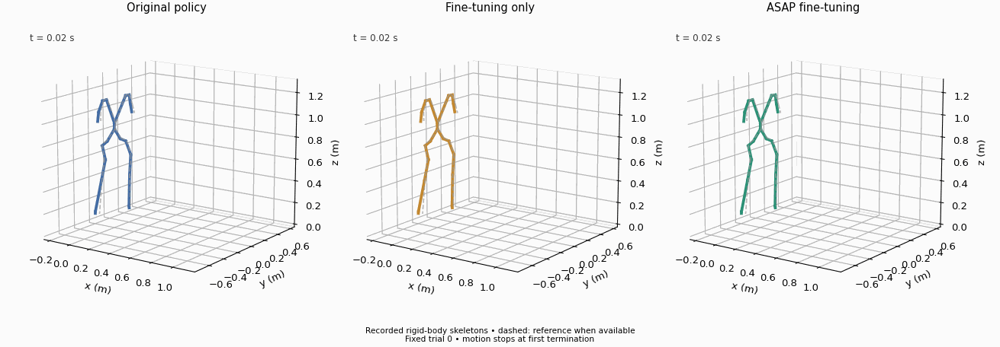
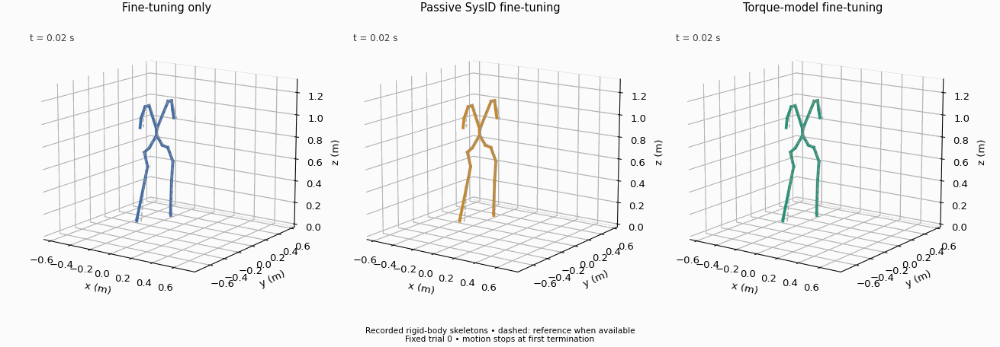

# Matched Squat deployment comparison

All six final checkpoints are evaluated in target B (ankle Kp16) with explicit zero task-observation noise, identical initialization-noise settings and the original Squat termination criteria. Three evaluation seeds (8101–8103), each with 32 trials, give 96 trials per condition. Adapted policies receive 1000 additional PPO updates from the same source checkpoint; deployment uses the ordinary B controller without any learned correction. Final policy checkpoints are fixed in advance. Neural calibration checkpoints are selected on validation replay only; physical gains are fitted by their declared training objective.

| Policy deployed in B | Complete / 96 | Survival (s) | First-second body error (mm) | First-second root-relative error (mm) | Full-horizon body error, completed trials only (mm) |
|---|---:|---:|---:|---:|---:|
| Original pretrained | 51 | 4.546 | 95.18 | 32.34 | 129.10 |
| Fine-tuning only | 96 | 5.220 | 92.62 | 29.06 | 94.45 |
| ASAP fine-tuning | 87 | 4.984 | 97.14 | 33.52 | 96.91 |
| Passive SysID fine-tuning | 93 | 5.173 | 91.41 | 30.87 | 95.98 |
| Shared torque-model fine-tuning | 96 | 5.220 | 91.85 | 30.39 | 105.12 |
| Active-acquisition SysID fine-tuning | 92 | 5.127 | 93.54 | 33.41 | 106.06 |

All 96 trials in every condition complete the first second. Its error means therefore include all trials. Full-horizon means condition on completion and must be read with completion and survival; they are not failure-inclusive scores. Three-second counts and errors are also included in the [summary](summary.json), alongside [individual trial reports](tracking_comparison.json).

**Result:** additional training improves completion relative to the original policy. Calibration does not establish an additional control benefit over equal-budget fine-tuning in this run. ASAP has lower completion and worse first-second errors. Passive SysID lowers first-second global error by 1.21 mm but has lower completion and higher root-relative error. The torque model ties fine-tuning on completion, lowers first-second global error by 0.78 mm, but has higher root-relative error and higher full-horizon body error (105.12 versus 94.45 mm, both over 96 completed trials). Active-acquisition SysID completes 92/96 and has higher first-second errors than FT-only, despite much lower replay error than the older passive fit. These mixed outcomes do not support a uniform method ranking. [Active method, matched-state audit and full trial reports](../active_acquisition/README.md).

Each adapted condition has **one training seed**. Evaluation seeds measure variation in initial conditions, not variability across independently trained policies. Calibration objectives, architectures and transition budgets differ between correction mechanisms; the common downstream budget controls extra task-policy training, not total compute.

## Audits

[Effective configuration extracts](effective_setting_audit.json) expose the observed actor/critic inputs, noise, initialization, termination and physics settings for every checkpoint. Nonzero noise entries on unused observation keys and differing disabled low-height thresholds do not affect these evaluations. [Stored-state comparison](initial_state_audit.json) finds exactly zero difference in joint positions/velocities, root state and stored actions across all 32 first stored states of seed8101. This establishes matched stored initialization for that seed; it does not independently verify every hidden simulator state.

The earlier original-policy result (37/96) inherited nonzero sensor noise. It is retained in [the historical audit](../controlled_squat/README.md) and is superseded by the matched original result of 51/96 for comparisons. No weights were changed by this reevaluation.

## Actual-motion comparisons

Both animations show **fixed seed8101, trial0**, chosen by index rather than performance. Solid lines are actual recorded simulated body positions; dashed lines are reference positions. A panel stops at its first termination. These are derived skeleton views, not Gym renders, and do not replace aggregate trial metrics.

Animation provenance: [action comparison](../../assets/animations/matched_squat_action.json), [model comparison](../../assets/animations/matched_squat_models.json).
