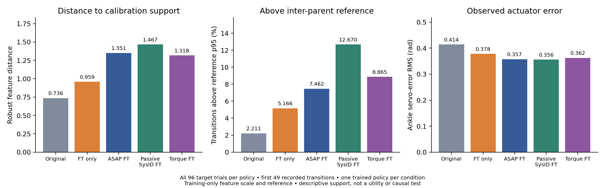

# Deployment actuator regimes: descriptive overlap audit

This post-hoc analysis measures actuator-feature support for **all 96 matched Squat trials per policy**, using the first 50 stored states (49 transitions, nominally 0.02–1.00 s). All trials complete this prefix, so none is excluded based on eventual success. It queries target-B deployment states against the actual weighted mixed30 calibration pool: 41 continuous clips, 30 original parents, 6198 unique transitions. The local/server calibration-file SHA256 matches and is recorded in [the raw report](summary.json).

Each transition has 12 features: four ankle servo errors, four joint velocities and four position-command changes. Post-step timing uses $e_i=q_{\rm default}+0.25a[i+1]-q[i]$ and command change $0.25(a[i+1]-a[i])$. These are measured state/command relationships, not corrective-action labels. Modeled source torque clipping is separately reported; no prefix ankle command reaches the modeled 50 Nm limit in these trials.

Feature coordinates use weighted training-only medians and IQRs, with equal task/parent/clip weights and equal transition weights within clips. Euclidean distance to the closest training transition provides a descriptive support measure. To avoid a self-match reference, each calibration transition is also queried against other original parents; the weighted 95th percentile of those distances is 3.38253. This threshold is a chosen descriptive reference, **not an OOD probability, confidence bound or calibrated failure predictor**. Nearest-neighbor geometry does not estimate occupancy probabilities.

| Target policy | Mean nearest distance | Transitions above reference p95 (%) | Mean trial servo-error RMS (rad) |
|---|---:|---:|---:|
| Original | 0.736 | 2.21 | 0.414 |
| FT only | 0.959 | 5.17 | 0.378 |
| ASAP FT | 1.351 | 7.46 | 0.357 |
| Passive SysID FT | 1.467 | 12.67 | 0.356 |
| Torque FT | 1.318 | 8.86 | 0.362 |

Adapted policies occupy different actuator regimes from the original policy under this feature metric. ASAP is farther from calibration support than FT-only, making distribution change a measurable candidate explanation for replay/control disagreement. This is **not evidence that this change caused its lower completion**: passive SysID is farther still but completes 93/96 versus ASAP 87/96. Lower servo error likewise does not uniformly predict control quality. The audit observes B deployment, not the states encountered during fine-tuning in calibrated A; it cannot establish exploitation of simulator errors.

Other boundaries matter. The calibration pool spans three tasks and full rollout phases, whereas this audit covers only the first second of Squat. Calibration-policy sensor noise can differ from the explicitly noiseless matched deployment. Twelve actuator features omit whole-body/contact state and temporal history; their distance depends on the chosen coordinates and scaling. Correlated transitions and 96 evaluation trials from one trained policy are not independent training replications. These are exploratory observations, not a preregistered test of data utility.

The queued data-content selectors, budgets and checkpoint rules are unchanged by this audit. A controlled intervention on training data, followed by independent replay and policy evaluation, remains necessary to test the hypothesis. [Analysis script](../../scripts/inspect_policy_regimes.py); source recordings are retained on the server and the public JSON includes all per-trial summary measures.

Reproduce with trusted artifacts using `python scripts/inspect_policy_regimes.py --calibration /path/to/controlled/datasets/mixed30.pkl --evaluations /path/to/matched_eval/tracking`. The evaluation argument accepts either that full recording directory or the compact first-second extraction retained on the server. The analysis runs on CPU and does not modify policies, simulator state or queued selections.
