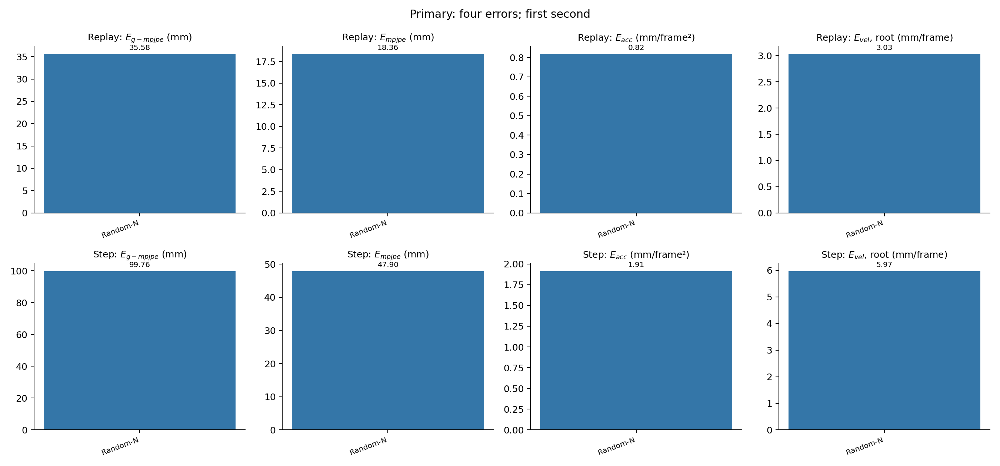
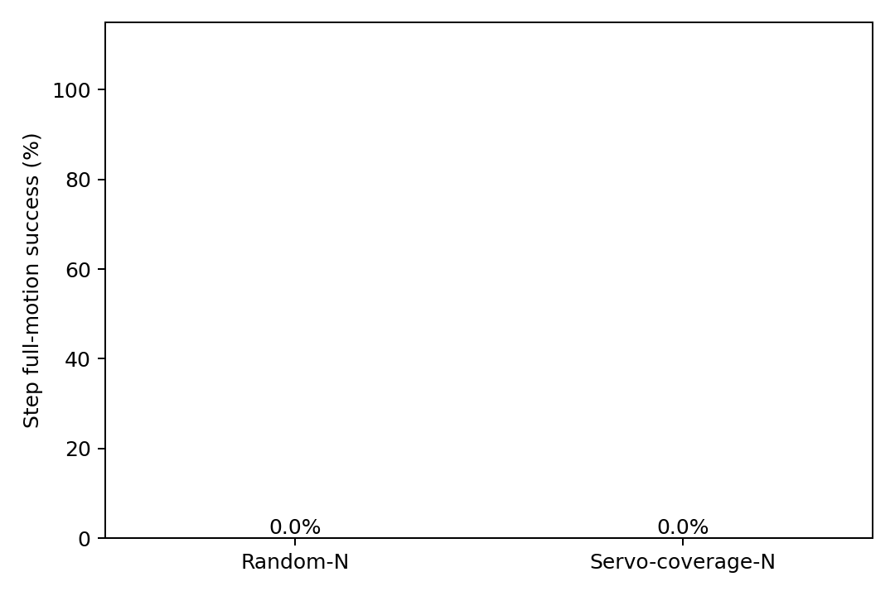
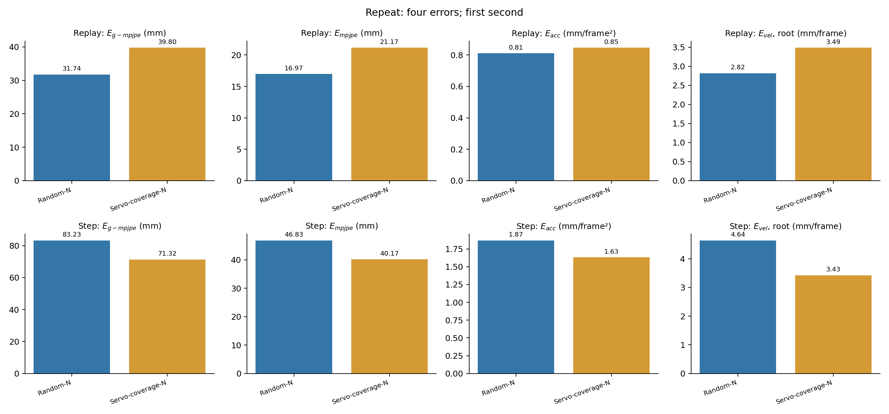
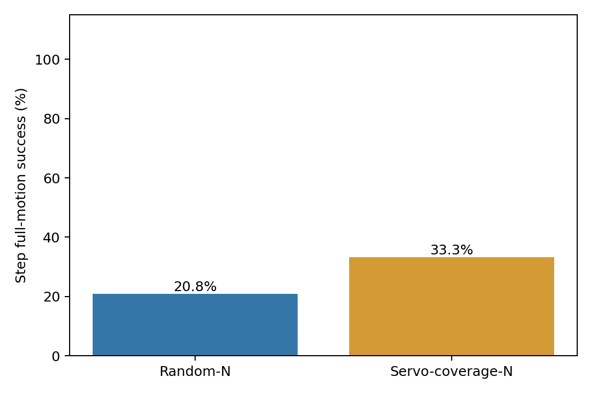

# Servo-error selection results

The selectors were frozen before learning. The planned arms use the same parents and selected data budget. Results include completed audited conditions only. Replay and Step control are separate endpoints. Scheduled policies use repaired inputs and reset.

Replay has 24 measured bodies. Step tracking has 27 points. Errors use the first second. Velocity is root velocity at 50 Hz. Units are mm for position, mm/frame² for acceleration and mm/frame for velocity. Early terminations change inclusion; full-motion means include successful trials only.

## Primary

| Group | Replay E_g-mpjpe | Replay E_mpjpe | Replay E_acc | Replay E_vel | Complete replay (%) |
|---|---:|---:|---:|---:|---:|
| Random-N | 35.575 | 18.359 | 0.817 | 3.029 | 100.0 |
| Servo-coverage-N | 42.932 | 23.317 | 0.847 | 3.824 | 100.0 |

| Group | Success (%) | Completion (%) | First-second inclusion (%) | E_g-mpjpe | E_mpjpe | E_acc | E_vel |
|---|---:|---:|---:|---:|---:|---:|---:|
| Random-N | 0.0 | 0.0 | 100.0 | 99.759 | 47.901 | 1.913 | 5.965 |
| Servo-coverage-N | 0.0 | 0.0 | 100.0 | 107.395 | 45.579 | 1.923 | 6.170 |
| FT-only | 5.2 | 7.3 | 100.0 | 79.515 | 40.376 | 1.821 | 4.211 |

| Group | Successful full-motion inclusion (%) | E_g-mpjpe | E_mpjpe | E_acc | E_vel |
|---|---:|---:|---:|---:|---:|
| Random-N | 0.0 | N/A | N/A | N/A | N/A |
| Servo-coverage-N | 0.0 | N/A | N/A | N/A | N/A |
| FT-only | 5.2 | 143.268 | 44.413 | 1.268 | 3.658 |

Servo minus Random at the same planned training seed. Positive error differences mean higher error.

| Endpoint | E_g-mpjpe | E_mpjpe | E_acc | E_vel |
|---|---:|---:|---:|---:|
| Replay | +7.357 | +4.959 | +0.030 | +0.795 |
| Step first second | +7.636 | -2.322 | +0.010 | +0.205 |

Success changes by +0.0 percentage points; mean survival changes by +0.038 seconds. This is one whole-training-run contrast, not an isolated feature effect.

Matched primary-seed control contrast: each arm minus FT-only. Positive error differences mean higher error.

| Group | Success difference (percentage points) | E_g-mpjpe | E_mpjpe | E_acc | E_vel |
|---|---:|---:|---:|---:|---:|
| Random-N | -5.2 | +20.244 | +7.526 | +0.092 | +1.755 |
| Servo-coverage-N | -5.2 | +27.880 | +5.203 | +0.102 | +1.960 |
## Repeat

| Group | Replay E_g-mpjpe | Replay E_mpjpe | Replay E_acc | Replay E_vel | Complete replay (%) |
|---|---:|---:|---:|---:|---:|
| Random-N | 31.744 | 16.967 | 0.811 | 2.819 | 100.0 |
| Servo-coverage-N | 39.797 | 21.167 | 0.846 | 3.487 | 100.0 |

| Group | Success (%) | Completion (%) | First-second inclusion (%) | E_g-mpjpe | E_mpjpe | E_acc | E_vel |
|---|---:|---:|---:|---:|---:|---:|---:|
| Random-N | 20.8 | 21.9 | 100.0 | 83.226 | 46.827 | 1.869 | 4.638 |
| Servo-coverage-N | 33.3 | 36.5 | 100.0 | 71.321 | 40.166 | 1.632 | 3.426 |

| Group | Successful full-motion inclusion (%) | E_g-mpjpe | E_mpjpe | E_acc | E_vel |
|---|---:|---:|---:|---:|---:|
| Random-N | 20.8 | 95.213 | 55.456 | 1.192 | 3.599 |
| Servo-coverage-N | 33.3 | 99.420 | 46.786 | 1.177 | 3.646 |

Servo minus Random at the same planned training seed. Positive error differences mean higher error.

| Endpoint | E_g-mpjpe | E_mpjpe | E_acc | E_vel |
|---|---:|---:|---:|---:|
| Replay | +8.054 | +4.201 | +0.035 | +0.668 |
| Step first second | -11.904 | -6.661 | -0.237 | -1.212 |

Success changes by +12.5 percentage points; mean survival changes by +0.487 seconds. This is one whole-training-run contrast, not an isolated feature effect.

## Fixed-data training-seed sensitivity

Both runs are retained. Calibration and policy training seeds change together; replay and deployment seeds stay fixed. These differences do not isolate either training stage. There is no matched repeat FT-only.

| Group | Primary success (%) | Repeat success (%) | Primary first-second inclusion (%) | Repeat first-second inclusion (%) |
|---|---:|---:|---:|---:|
| Random-N | 0.0 | 20.8 | 100.0 | 100.0 |
| Servo-coverage-N | 0.0 | 33.3 | 100.0 | 100.0 |

Repeat-minus-primary four-error differences are retained in seed_sensitivity.json. Prefix means remain conditional on their reported inclusion. Two runs do not establish a population ranking.

## Supplemental Low-error calibration

Skipped because fewer than 50 minutes remained before the GPU cutoff. No Low-error model was trained or evaluated.

Stratified replay uses separate ankle magnitude bins from the training pool. Missing bins are not filled. Frame entries can overlap across ankles. Joint-error tables are in stratified_metrics.md; raw strata and inclusion are in stratified_metrics.json.

Phase quotas cover the available training pool, rather than the full reference. Contact uses a height/speed proxy. Continuous speed and contact distributions still differ. No same-domain floor is subtracted. The selected budget is not total acquisition cost.

The first run includes a matched FT-only policy. The repeat compares two selectors at its own shared seed; it has no new matched FT-only. Runs are reported separately. Two seeds do not establish a reliable ranking.

[Second-seed calibration report](repeat/replay_metrics.md). Calibration can finish before its policy evaluation; these endpoints remain separate.
