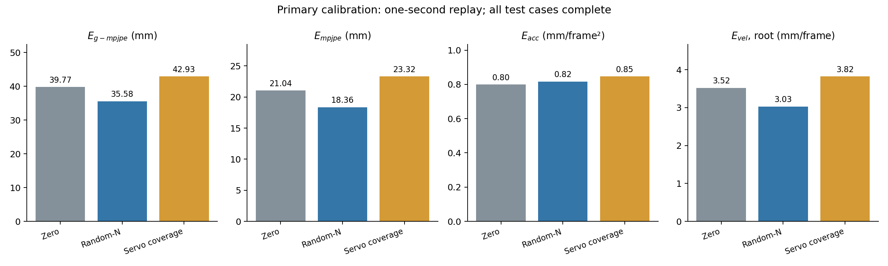

# Servo-coverage replay

Calibration is complete and independently audited. Validation selects update 500 (49.31 mm) over update 1,000 (59.96 mm). Both candidates complete all validation cases. Step control is reported separately in the full results.

Test errors use one second and 24 measured bodies. Both learned arms and the source-zero control complete 100% of test replays. Position is in mm, acceleration in mm/frame² and root velocity in mm/frame at 50 Hz.

| Group | E_g-mpjpe | E_mpjpe | E_acc | E_vel |
|---|---:|---:|---:|---:|
| Source20, zero correction | 39.774 | 21.043 | 0.799 | 3.521 |
| Random-N | 35.575 | 18.359 | 0.817 | 3.029 |
| Servo-coverage-N | 42.932 | 23.317 | 0.847 | 3.824 |

Servo-coverage has higher error than Random-N and zero correction on all four measures in this training run. The modest coverage increase did not improve calibration here. See the [full results](../../metrics.md) for the separate control comparison.

The selected training floor is 19.61 mm, compared with 21.52 mm for Random. These reconstruction errors are retained without subtraction or window replacement. Continuous speed and contact-proxy distributions still differ. This comparison cannot identify a single causal feature.

Actual records were checked for case identities and hashes, and all validation/test metric aggregates were recomputed. Learned and shared source-zero replays have exactly matching stored starts, actions and clocks. Both validation candidates and all raw test cases remain available.

[Per-ankle strata](../../calibration_stratified_metrics.md). Magnitude bins are fixed from training; inclusion varies. Joint errors and body errors are separate measures.
