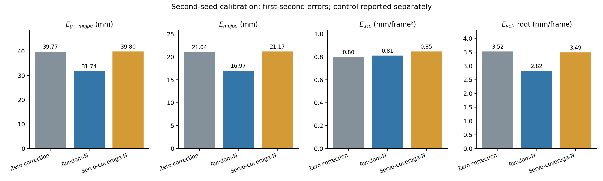

# Second-seed calibration replay

Only completed, audited calibrators are shown. Step control is a separate endpoint. This run reuses exactly the same selected data; it is not new acquisition.

Position is in mm, acceleration in mm/frame² and root velocity in mm/frame at 50 Hz. Replay uses the first second and 24 measured bodies. The source-zero control was recorded once at the fixed shared replay seed.

| Group | E_g-mpjpe | E_mpjpe | E_acc | E_vel | Complete replay (%) |
|---|---:|---:|---:|---:|---:|
| Shared source20 zero | 39.774 | 21.043 | 0.799 | 3.521 | 100.0 |
| Random-N | 31.744 | 16.967 | 0.811 | 2.819 | 100.0 |
| Servo-coverage-N | 39.797 | 21.167 | 0.846 | 3.487 | 100.0 |

Servo minus Random at the second training seed. Positive values mean higher error.

| E_g-mpjpe | E_mpjpe | E_acc | E_vel |
|---:|---:|---:|---:|
| +8.054 | +4.201 | +0.035 | +0.668 |

Random has lower error on all four measures in both completed calibration runs. This selector has not shown a replay advantage in these two seeds. The coverage contrast is modest, and selection still changes contact and initialization conditions. These results do not rule out other data-selection rules.

| Group | Validation at 500 (mm) | Validation at 1,000 (mm) | Selected update |
|---|---:|---:|---:|
| Random-N | 48.108 | 42.053 | 1000 |
| Servo-coverage-N | 95.602 | 52.236 | 1000 |

Both validation candidates are retained. Test outcomes do not select checkpoints. Actual case identities, hashes and metric aggregates were recomputed from physical records. Learned and shared-zero starts, actions and clocks match exactly. No reconstruction floor is subtracted.

Two training seeds cannot establish a reliable ranking. Do not select the better run. The full [control report](../metrics.md) includes completed audited policies only.

## Per-ankle magnitude strata

Bins are fixed from training. Inclusion is the share of planned scored samples for that ankle. Errors average available cases by parent and task. Entries overlap across ankles and are not independent trials. Sign is not separated in this table.

| Group | Ankle | Magnitude | Inclusion (%) | Body error (mm) | Joint RMSE (rad) | Joint velocity RMSE (rad/s) |
|---|---|---|---:|---:|---:|---:|
| Random-N | Left pitch | Small | 30.9 | 35.068 | 0.11909 | 4.69782 |
| Random-N | Left pitch | Medium | 36.3 | 39.471 | 0.11757 | 1.59466 |
| Random-N | Left pitch | Large | 32.8 | 37.369 | 0.11309 | 2.16648 |
| Random-N | Left roll | Small | 35.6 | 40.249 | 0.06510 | 3.49348 |
| Random-N | Left roll | Medium | 32.1 | 27.916 | 0.03900 | 3.17163 |
| Random-N | Left roll | Large | 15.9 | 43.574 | 0.04800 | 6.98064 |
| Random-N | Right pitch | Small | 43.8 | 39.364 | 0.19266 | 5.76085 |
| Random-N | Right pitch | Medium | 29.3 | 39.465 | 0.15299 | 3.16152 |
| Random-N | Right pitch | Large | 23.9 | 26.779 | 0.08311 | 1.58059 |
| Random-N | Right roll | Small | 36.7 | 25.290 | 0.06501 | 2.70241 |
| Random-N | Right roll | Medium | 36.6 | 22.221 | 0.02534 | 2.01176 |
| Random-N | Right roll | Large | 26.7 | 40.358 | 0.03451 | 2.48726 |
| Servo-coverage-N | Left pitch | Small | 30.9 | 43.897 | 0.12009 | 3.95977 |
| Servo-coverage-N | Left pitch | Medium | 36.3 | 42.811 | 0.15745 | 1.79474 |
| Servo-coverage-N | Left pitch | Large | 32.8 | 47.567 | 0.13122 | 2.71353 |
| Servo-coverage-N | Left roll | Small | 35.6 | 46.248 | 0.07545 | 3.62826 |
| Servo-coverage-N | Left roll | Medium | 32.1 | 36.108 | 0.05195 | 3.04532 |
| Servo-coverage-N | Left roll | Large | 15.9 | 61.119 | 0.06987 | 6.54256 |
| Servo-coverage-N | Right pitch | Small | 43.8 | 45.096 | 0.17375 | 3.67191 |
| Servo-coverage-N | Right pitch | Medium | 29.3 | 48.230 | 0.14632 | 2.99515 |
| Servo-coverage-N | Right pitch | Large | 23.9 | 30.399 | 0.11796 | 2.09295 |
| Servo-coverage-N | Right roll | Small | 36.7 | 30.926 | 0.06667 | 1.64831 |
| Servo-coverage-N | Right roll | Medium | 36.6 | 29.673 | 0.03091 | 1.39001 |
| Servo-coverage-N | Right roll | Large | 26.7 | 60.459 | 0.02450 | 2.65646 |
