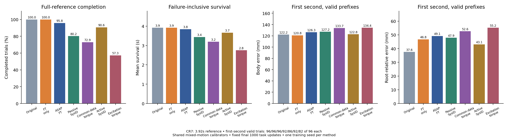
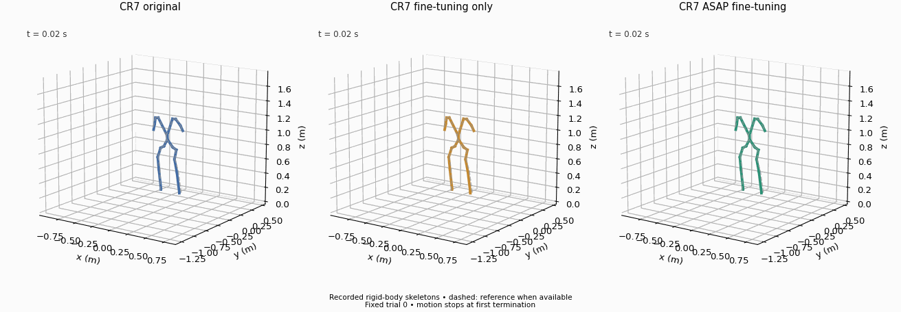
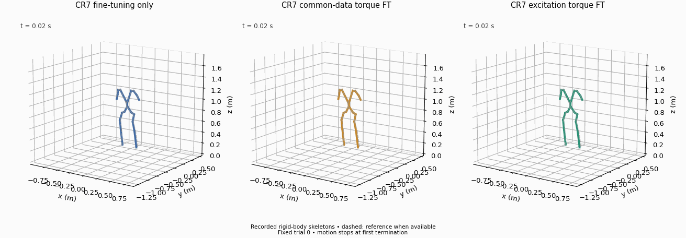

# CR7: shared-calibrator task-policy extension

**Status:** all seven standalone target-policy comparisons complete. Evaluation commands request 196 frames at 50 Hz (3.92 s), matching the CR7 reference duration rather than the Squat horizon. Each condition has three evaluation seeds and 32 trials per seed. Each adapted policy starts from the same CR7 `model_6000.pt` and receives 1000 additional task-policy updates with optimizer reset; its final checkpoint is fixed before evaluation.

The action and common-data torque models, passive/active gains and excitation-trained torque model are reused unchanged from their mixed-motion calibration experiments. CR7 was included in calibration: this is reuse across task policies, **not a held-out calibration motion**. Models are frozen during task training and absent from standalone B deployment. The fitted gains belong to the training simulator; evaluation restores target ankle Kp16 for every condition.

## Completed metrics

| Policy | Full completion /96 | Survival (s) | 1s body / root-relative (mm; valid n) | 3s body / root-relative (mm; valid n) | Full body / root-relative (mm; successful n) |
|---|---:|---:|---|---|---|
| Original | 96 | 3.920 | 122.21 / 37.58 (96) | 125.22 / 47.53 (96) | 134.30 / 44.77 (96) |
| FT only | 96 | 3.920 | 120.84 / 46.76 (96) | 113.32 / 52.00 (96) | 116.53 / 51.55 (96) |
| ASAP FT | 92 | 3.847 | 126.33 / 49.15 (96) | 126.28 / 54.31 (93) | 127.48 / 53.57 (92) |
| Passive SysID | 77 | 3.439 | 127.17 / 47.90 (92) | 125.03 / 52.97 (79) | 121.21 / 50.93 (77) |
| Common-data torque | 70 | 3.191 | 133.71 / 52.63 (86) | 141.73 / 53.82 (70) | 146.83 / 53.21 (70) |
| Active SysID | 87 | 3.665 | 122.81 / 43.07 (92) | 120.48 / 50.86 (87) | 126.99 / 50.16 (87) |
| Excitation torque | 55 | 2.755 | 134.37 / 55.21 (82) | 129.08 / 56.10 (55) | 134.78 / 54.56 (55) |

[Raw 672 trial reports](tracking_comparison.json), [summary and provenance hash](summary.json).

The original policy and FT-only both complete 96/96. FT-only lowers full-horizon global body error from 134.30 to 116.53 mm but raises root-relative error from 44.77 to 51.55 mm, over the same 96 successful trials. Even this continued-training effect is a metric tradeoff, not a uniform improvement. Every calibrated condition has lower completion than FT-only in this training seed. ASAP completes 92/96 and has higher first-second global/root-relative errors (126.33/49.15 versus 120.84/46.76 mm, all 96 trials).

Some other calibrated policies terminate before the first second: the passive/common-torque/active/excitation prefix counts are 92/86/92/82. Their means therefore condition on different subsets and cannot be treated as failure-inclusive tracking scores. Common-torque and excitation terminations occur at 0.92–1.72 s and 0.84–1.72 s, respectively. These are recorded terminations; their causes are not classified as falls. Full-horizon means also condition on different successful subsets. [Failure timing](termination_timing.json).

The shared excitation model completes 95/96 on Squat but its newly fine-tuned CR7 policy completes 55/96. This is task dependence within a seen-motion calibration setting; it is not proof of out-of-distribution failure or of a specific data feature. One task-policy training seed per method and one shared calibrator per representation limit inference. Calibration architecture, acquisition phase/data amount and training objectives differ between methods; the equal downstream budget does not control total calibration compute.

## Evaluation audit

[Matched-state/config audit](matched_state_config_audit.json) verifies zero difference in first stored joint/root states and actions relative to FT-only for all 96 trials per method. Used actor/history noise is zero, enabled termination flags/thresholds match, initialization settings and physics match, and recorded commands use the ordinary task environment without a correction. Checkpoint hashes for all seven conditions and recording hashes are included. This does not independently verify hidden solver state.

The original policy's raw configuration has extra differences in unused noise keys and a disabled minimum-height threshold (0.2 versus 0.3 m). [Initial configuration inspection](config_differences_initial.json) preserves those differences. The audit retains raw configurations and separately compares actor-used noise and thresholds whose termination flags are enabled; no evaluation setting or policy was changed after seeing outcomes.

## Actual-motion illustrations

Both animations use the fixed seed8101 trial0, selected by index rather than performance. Solid skeletons show actual simulated rigid-body positions, dashed skeletons the reference. A panel stops at the first recorded termination. These are derived views, not Gym renders, and do not establish representative-trial behavior.

[Action animation provenance](../../../assets/animations/cr7_action.json), [torque animation provenance](../../../assets/animations/cr7_torque.json). All displayed fixed trial0 recordings complete, while failures occur in other trials; the animations therefore do not visualize the aggregate failure rate. Aggregate metrics include every trial, including failures.
