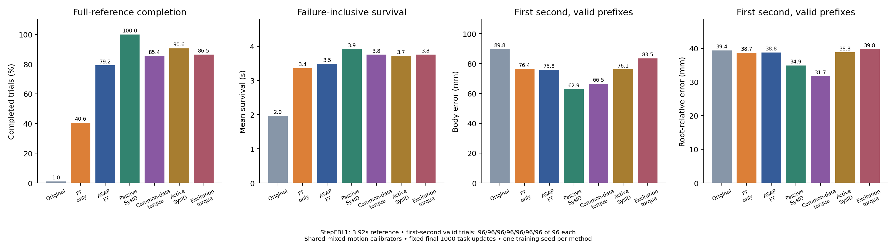
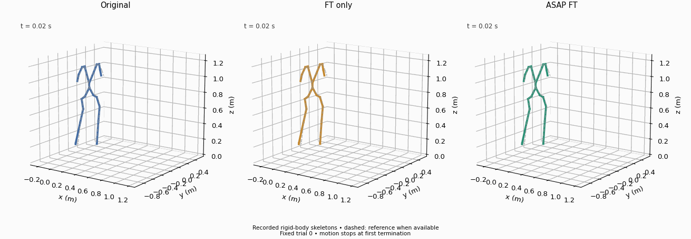
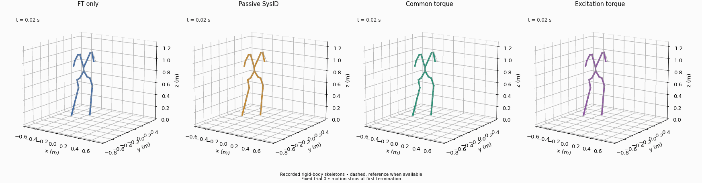

# StepFBL1: shared-calibrator task-policy extension

**Status:** all seven standalone target-policy comparisons complete. Actual evaluation commands request196 frames at50Hz (3.92s). Each condition has seeds8101–8103 and32 trials per seed. Adapted policies receive1000 fresh task-training updates from the same recorded StepFBL1 `model_6000.pt`, with optimizer reset and fixed final checkpoints.

The frozen action/common-torque/excitation-torque models and passive/active gains are reused from mixed-motion calibration. StepFBL1 was present in those calibration datasets: this is task-policy reuse, not a held-out calibration motion or hardware experiment. Corrections are used in source training and absent at deployment; all B evaluations restore ankle Kp16 and preserve the original termination criteria.

## Completed metrics

| Policy | Full completion /96 | Survival (s) | 1s body / root-relative (mm; valid n) | 3s body / root-relative (mm; valid n) | Full body / root-relative (mm; successful n) |
|---|---:|---:|---|---|---|
| Original | 1 | 1.964 | 89.77 / 39.35 (96) | 94.16 / 37.29 (1) | 92.36 / 36.77 (1) |
| FT only | 39 | 3.360 | 76.44 / 38.68 (96) | 139.52 / 48.66 (67) | 127.50 / 44.66 (39) |
| ASAP FT | 76 | 3.484 | 75.79 / 38.76 (96) | 88.05 / 40.51 (76) | 88.17 / 41.48 (76) |
| Passive SysID | 96 | 3.920 | 62.87 / 34.91 (96) | 82.49 / 41.01 (96) | 85.58 / 42.46 (96) |
| Common-data torque | 82 | 3.755 | 66.46 / 31.72 (96) | 96.18 / 41.42 (85) | 94.19 / 41.00 (82) |
| Active SysID | 87 | 3.718 | 76.10 / 38.81 (96) | 101.45 / 45.72 (87) | 96.59 / 42.88 (87) |
| Excitation torque | 83 | 3.760 | 83.49 / 39.78 (96) | 121.47 / 52.37 (88) | 114.00 / 51.00 (83) |

[Raw672 trial reports](tracking_comparison.json), [summary and source-report hash](summary.json).

This task supplies a positive calibration-plus-adaptation outcome in the current training seed. Original, FT-only and ASAP complete1/96,39/96 and76/96; passive SysID completes96/96. Passive SysID also lowers first-second global/root-relative body errors from FT-only's76.44/38.68 to62.87/34.91mm, with all96 prefixes valid in each condition. These are matched-prefix comparisons, unlike a successful-trial-only full-reference mean. ASAP's higher completion coexists with a small first-second global improvement and a small root-relative regression. Common torque, active SysID and excitation torque complete82/96,87/96 and83/96, all above FT-only's39/96 in this seed, with mixed early tracking metrics.

All methods reach the first second. Three-second valid counts are1/67/76/96/85/87/88 in the table order, and full-reference means condition on1/39/76/96/82/87/83 successful trials. Those later error means use different subsets and cannot establish failure-inclusive tracking rankings. Original policy terminations occur at1.54–2.58s; ASAP terminations at1.24–2.74s; FT-only at2.16–3.64s. [Every termination's timing](termination_timing.json) is retained; no event is classified as a fall without cause evidence.

The passive fit remains13.01/10.42 rather than the configured target16/16. Its useful downstream surrogate in Step does not demonstrate physical parameter recovery, and it was not chosen based on Step test performance. Active fitting completes fewer Step trials than passive fitting; excitation torque performs similarly to common torque on completion and has higher first-second tracking errors. This does not establish that active exploration or high-rate excitation is intrinsically worse: their data phase, model and fitting procedures differ, and only one trained policy/calibrator combination is tested per method.

Together with the negative additional-benefit results on Squat and CR7, this shows task dependence of calibration-plus-policy adaptation under the current protocol. It does not identify which calibration-data feature caused improvement or failure. The queued equal-budget within-model selectors are the direct test of that narrower data-content question. Three deployment seeds describe variability of one trained policy, not independent training replications.

## Evaluation audit

[All-seed stored-state and configuration audit](matched_state_config_audit.json) checks all96 first recorded joint/root states and actions per method against FT-only: every maximum difference is exactly zero. Used actor/history noise is zero, enabled termination criteria, initialization and physics match, and actual commands deploy the ordinary task environment without extra actions. All21 evaluation commands agree on196 frames/3.92s. Source checkpoint SHA matches the recorded `9e67bb692d34867d9861bdf8ff0e768a65a590f1a8cbcbe91b1051a34c0ca91b`. Policy and recording hashes are retained; hidden solver state is not independently verified.

[Raw configuration differences](config_differences.json) retain unused noise keys and the disabled minimum-height threshold difference for the original policy. Effective settings match; no threshold or noise rule was changed after seeing outcomes.

## Actual-motion illustrations

Both animations use fixed seed8101 trial0. Solid skeletons are recorded simulated body positions; dashed skeletons are the human-motion reference. Panels freeze at the first recorded termination. These are derived views, not Gym renders, and the index-fixed example is not claimed to represent the aggregate96 trials.

[Action-animation provenance](../../../assets/animations/step_action.json), [calibration-animation provenance](../../../assets/animations/step_calibration.json). In the fixed action illustration, the original terminates atrow92 (1.84s); FT-only and ASAP complete. The fixed calibration illustration has no termination in its four panels. These index-fixed views do not show every aggregate failure; all failures in other trials remain in the reports.
