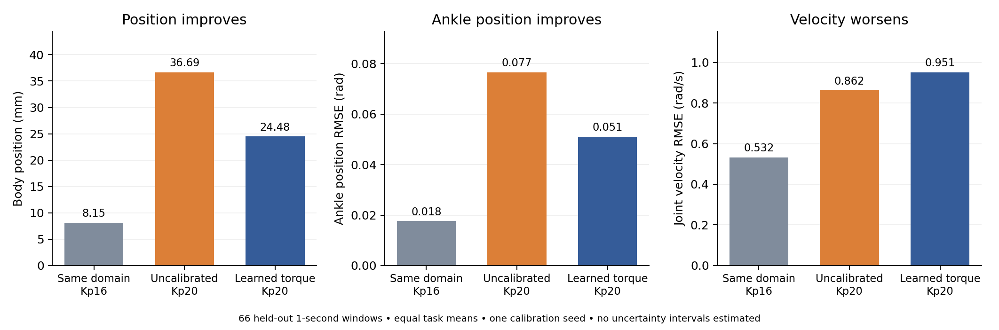

# Shared torque correction: measured replay

**Status:** calibration, held-out replay and Squat policy evaluation complete. The policy completes 96/96 target trials, matching equal-budget FT-only. Full-horizon body error is higher (105.12 versus 94.45 mm, both over 96 completed trials); the lower replay error does not establish additional control benefit. [Matched downstream evidence](../matched_squat/README.md).

This UAN-style adaptation uses the same mixed30 target-policy pool measured at 50 Hz. A joint-shared 40→128→128→1 ELU actor consumes 20 position/velocity-error history samples from actual source simulator states at 200 Hz. It applies torque corrections only to the four ankles, then clips the total PD-plus-correction torque. Calibration uses 1000 PPO updates and 96 steps per environment. This matches the action baseline's simulated time per update but uses four times as many PPO transitions and a different architecture; it cannot isolate representation alone.

Validation selected `model_1000.pt` with body MPJPE 33.02 mm. [Checkpoint selection](selection.json). The isolated test uses the same 66 windows as the action-model comparison, with nominal inputs held for four physics steps and output measured at 50 Hz.

| Test condition | Body MPJPE (mm) | Ankle RMSE (rad) | Joint-velocity RMSE (rad/s) |
|---|---:|---:|---:|
| Same-domain Kp16, zero correction | 8.154 | 0.01762 | 0.53217 |
| Source Kp20, zero correction | 36.685 | 0.07657 | 0.86174 |
| Source Kp20, learned torque | 24.482 | 0.05101 | 0.95127 |

All conditions complete all 66 one-second windows. Body error decreases by 33.3% and ankle error by 33.4%, while joint-velocity error increases by 10.4%. [Raw summaries with per-task and shorter-horizon metrics](replay_comparison.json).

The zero-correction baselines differ slightly from the action-model test because this replay steps the environment at 200 Hz. The model's lower position error must not be treated as a controlled architecture ranking, or as evidence of uniformly better transitions. Both learned corrections show a position/velocity tradeoff. Checkpoint selection uses body position alone, and the RL reward combines several state errors and action penalties; data deficiency is not the only possible explanation.

The source histories are genuinely sampled every 5 ms, but the target files remain measured at 50 Hz. [A separate experiment](../wave_acquisition/README.md) has acquired actual 200 Hz target records with and without bounded wave/noise excitation, holding torque architecture and training budgets fixed. This distinction preserves the boundary between the current common-data adaptation and a closer UAN data-collection adaptation.
