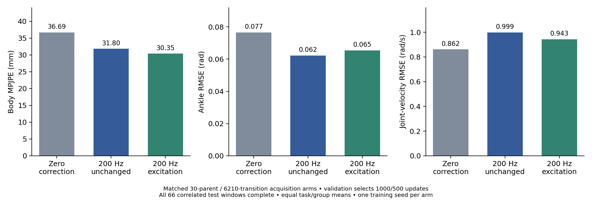
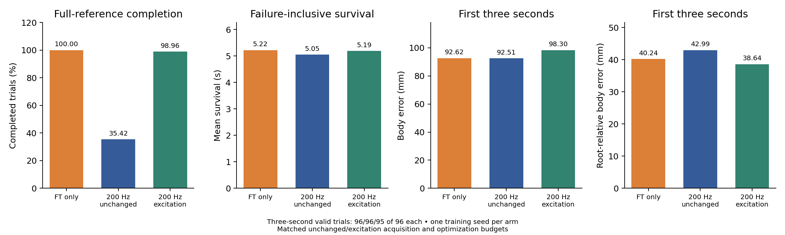
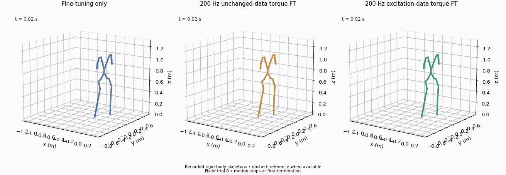

# Actual 200 Hz target acquisition: unchanged versus excitation

**Status:** physical acquisition, rate/command/feasibility audits and zero-correction replay checks complete. Both calibration arms and held-out replay are complete. Both downstream policy comparisons are complete: unchanged 34/96, excitation 95/96, versus equal-budget FT-only 96/96.

Both arms use the same 30 original mixed30 parents, ten per task, initialized from their first eligible continuous windows. Unchanged input holds recorded nominal position commands for four physics steps. The excitation arm adds sine, square or clipped Gaussian offsets at 200 Hz, bounded by ±0.04 rad on four ankles; sine/square frequencies are 1–3 Hz. [Actual excitation manifest](excitation_manifest.json). This is a G1 adaptation of UAN's excitation-data idea, with prerecorded task inputs plus offsets rather than the original robot/command interface.

All 60 acquired groups supply **208 actual post-step states**, nominally at 200 Hz, with consecutive timestamps separated by 5 ms within numerical tolerance. There is no synthetic upsampling. All groups pass the declared one-second feasibility and no-reset checks; maximum stored/executed command discrepancy is exactly zero for every group. [Acquisition audit](acquisition_audit.json). Each arm has 6210 unique within-record transitions and 31.05 seconds of within-record transition duration; the warm step is not counted as an additional recorded transition.

## Zero-correction replay checks

The new training records are replayed at 200 Hz, with recorded initialization velocities, no learned correction and the same nominal inputs. These are acquisition-integrity diagnostics, not held-out learned-model results.

| Replay dynamics | Acquisition arm | Complete / 30 | Body MPJPE (mm) | Ankle RMSE (rad) | Joint-velocity RMSE (rad/s) |
|---|---|---:|---:|---:|---:|
| Same-domain Kp16 | Unchanged | 30 | 0.349 | 0.000900 | 0.11883 |
| Same-domain Kp16 | Excitation | 30 | 0.376 | 0.001024 | 0.14230 |
| Source Kp20 | Unchanged | 30 | 23.687 | 0.057353 | 0.58305 |
| Source Kp20 | Excitation | 30 | 24.463 | 0.062037 | 0.62627 |

[Raw summaries](acquisition_replay_check.json) include all tasks. The sub-millimeter same-domain position floor is small relative to the source-domain mismatch, while velocity error remains nonzero. This validates useful measurement fidelity for this collection setup; it does not establish full recovery of hidden contact state.

## What changed in the data?

The following are equal means across the 30 group-level summaries, not independent training replications. Source saturation applies the Kp20 PD law at recorded target states; it is not a measured target torque.

| Observed feature | Unchanged | Excitation |
|---|---:|---:|
| Mean ankle range per group (rad) | 0.34165 | 0.34175 |
| Servo-error RMS (rad) | 0.92454 | 0.92390 |
| Ankle velocity RMS (rad/s) | 2.84317 | 2.83846 |
| Position-command change RMS (rad) | 0.02921 | 0.03320 |
| Modeled source saturation fraction (%) | 5.886 | 5.886 |

The bounded offsets primarily increase command-change RMS (about 13.7%); they barely change these range/error summaries. Thus “excitation data” is not a synonym for broader joint range or universally greater informativeness. Temporal spectra and distribution details can differ even when aggregate RMS is similar. Utility remains an empirical question, and this small perturbation does not test every excitation mechanism.

Both arms now receive the same shared 40→128→128→1 torque actor, 20-sample 200 Hz source history, hierarchical sampling and 1000 calibration updates. Original isolated validation/test policy records remain at 50 Hz. Each arm chooses its calibration checkpoint on validation and receives 1000 additional Squat policy updates, followed by common-noise B deployment without a correction. Architecture/data duration differ from the older common50Hz-data torque run; only these two new arms constitute the matched acquisition-content comparison.

## First completed calibration arm

Validation selects the unchanged-input model at 1000 updates, with body MPJPE 41.94 mm. [Selection](unchanged_selection.json). On the original isolated 66-window test, all cases complete: body error decreases from 36.69 to 31.80 mm and ankle RMSE from 0.07657 to 0.06223 rad, while joint-velocity error increases from 0.86174 to 0.99862 rad/s. [Full held-out summaries](unchanged_replay_comparison.json) retain shorter horizons and per-task metrics.

This is a partial replay benefit, approximately 13.3% in body position, with a 15.9% velocity regression. The new acquisition has shorter duration and narrower phase coverage than the older common-data run. It cannot isolate the effect of measurement rate. The matched excitation-data comparison is reported below; one training seed does not establish a reproducible data-content ranking.

## Matched calibration-content comparison

Both arms trained for 1000 updates with the same architecture, sampler hierarchy, seed and 6210 unique target transitions. The same validation rule selects update 1000 for unchanged inputs and 500 for excitation. Their actual zero-correction test summaries match exactly. [Excitation selection](excitation_selection.json), [excitation held-out replay](excitation_replay_comparison.json).

| Test condition | Body MPJPE (mm) | Ankle RMSE (rad) | Joint-velocity RMSE (rad/s) | Complete / 66 |
|---|---:|---:|---:|---:|
| Source 20, zero correction | 36.685 | 0.076569 | 0.861741 | 66 |
| Unchanged-input torque model | 31.800 | 0.062229 | 0.998618 | 66 |
| Excitation-input torque model | 30.350 | 0.065406 | 0.943374 | 66 |

Relative to unchanged input, excitation lowers global body error by 4.6% and velocity error by 5.5%, but raises ankle error by 5.1%. Both models regress velocity relative to zero correction. The intervention changes commands and resulting states with acquisition amount fixed; it is not a stable feature-utility ranking from one training seed. Similar joint ranges coexist with different error tradeoffs, motivating a more controlled selection/replication test rather than proving the hypothesis.

## Matched downstream comparison

All 96 unchanged-arm trials complete the first three seconds, but only 34 complete the full 5.22-second reference. The 62 terminations occur between 4.56 and 5.16 seconds. These are observed simulator terminations; their causes are not classified as falls from the saved summaries alone.

| Policy | Full completion / 96 | Mean survival (s) | First-second body error (mm) | Three-second body error (mm) | Full-horizon body error, completed trials only (mm) |
|---|---:|---:|---:|---:|---:|
| Equal-budget FT only | 96 | 5.220 | 92.625 | 92.617 | 94.450 (96 trials) |
| 200 Hz unchanged-data torque FT | 34 | 5.046 | 92.961 | 92.511 | 130.880 (34 trials) |
| 200 Hz excitation-data torque FT | 95 | 5.191 | 94.765 | 98.304 (95 valid trials) | 100.421 (95 trials) |

The similar early tracking errors do not capture the late completion deficit. The full-horizon means condition on different successful subsets and must be read with completion/survival. [Raw unchanged trials](unchanged_tracking_comparison.json), [failure timing and summary](unchanged_tracking_summary.json), [paired comparison report](comparison_summary.json), [raw excitation trials](excitation_tracking_comparison.json).

The [paired stored-state/configuration audit](paired_matched_state_config_audit.json) verifies exactly matching first stored joint/root states and actions relative to FT-only for all 96 trials per arm across all three seeds; recorded observation, dynamics, initialization and termination settings also match. Task noise is zero, dynamics are target Kp16, termination criteria are shared, the final 1000-update policy is fixed, and deployment attaches no torque model. One training seed remains the inference limit. Neither high-rate measurement nor a replay-position improvement establishes control benefit here.

Excitation improves completion relative to the unchanged-data arm, but its one terminated trial stops at 2.46s. Three-second tracking means therefore include 95 trials, whereas the other two conditions include all 96. Excitation first-second root-relative error is 28.484mm versus unchanged 32.808mm and FT-only 29.060mm; its global error is higher than both. Full-reference root-relative errors are 42.354/51.632/39.307mm for excitation/unchanged/FT-only, conditional on 95/34/96 successes. This is a mixed outcome, with no demonstrated extra completion or full-horizon tracking benefit over FT-only.

The paired acquisition changes the nominal commands and resulting target trajectories while fixing parent identities, unique-transition count, architecture, update budget and training seed. Its small joint-range difference and large completion difference motivate temporal/regime ablations, but do not establish which feature is useful or rule out sensitivity of optimization to the dataset. Independent training repetitions are still missing. Validation selected different calibration updates (500/1000) under the same fixed rule; no target test ranking selected a checkpoint.

The animation shows actual recorded rigid-body skeletons for the predeclared seed8101 trial0, with dashed reference; it is not a Gym render or a representative-trial claim. [Animation provenance](../../assets/animations/true_rate_squat.json). Aggregate results above include every trial and remain the performance evidence.
